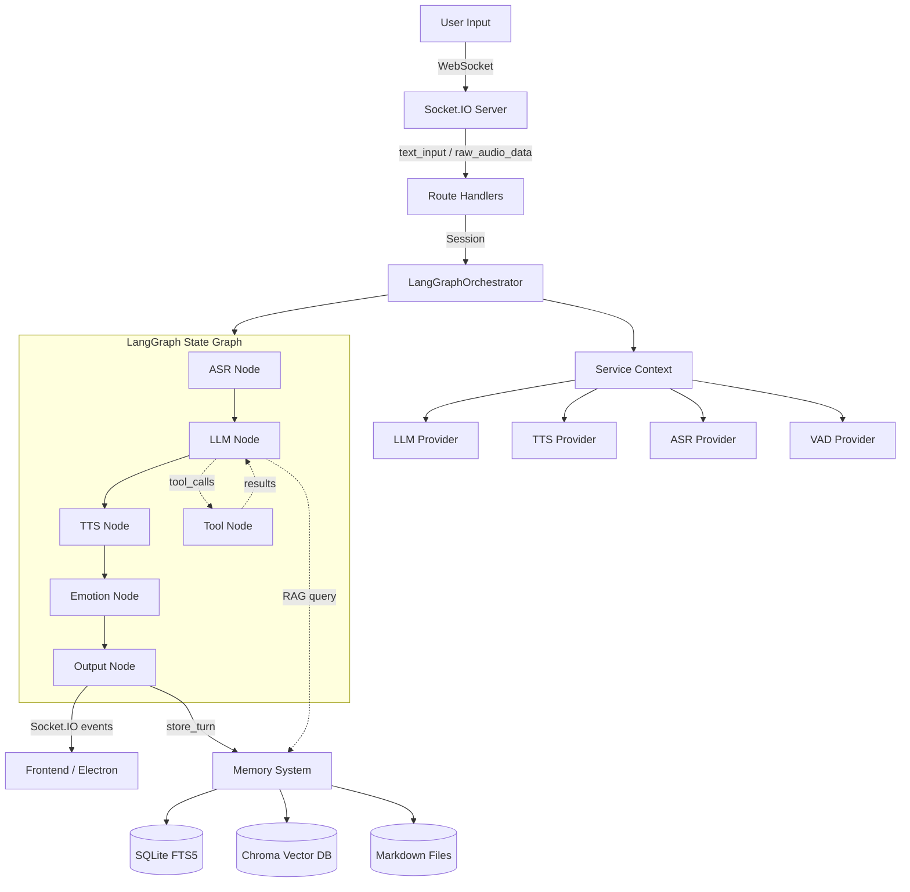

# Architecture

## Overview

Anima is a configurable AI virtual companion framework with Live2D avatar support.
It uses a **LangGraph state graph** for dialogue orchestration, a **plugin-based
service registry** for provider switching (LLM/ASR/TTS/VAD), and a **Wiki-based
memory system** (OpenClaw architecture) for long-term context.



## Core Components

### 1. LangGraph State Graph (`src/anima/orchestration/graph/`)

The dialogue pipeline is a directed state graph with these nodes:

| Node | Input | Output | Responsibility |
|------|-------|--------|----------------|
| `asr_node` | `raw_audio` | `user_text` | Speech recognition |
| `llm_node` | `user_text`, `messages` | `response_text`, `tool_calls` | LLM reasoning + RAG |
| `tts_node` | `response_text` | `tts_audio` | Text-to-speech |
| `emotion_node` | `response_text` | `emotion` | Sentiment analysis |
| `output_node` | all state | Socket.IO events | Distribution + memory storage |
| `tool_node` | `tool_calls` | `tool_results` | Tool execution |

The graph supports **two paths**:
- **Streaming path**: `llm_node → tts_node → emotion_node → output_node`
- **Tool-calling path**: `llm_node → tool_node → llm_node → ... → output_node`

### 2. Service Registry (`src/anima/config/core/registry.py`)

Decorator-based plugin system. Services register themselves:

```python
@ProviderRegistry.register_service("llm", "openai")
class OpenAILLM(LLMInterface):
    ...
```

Config-driven selection via `config.yaml`:
```yaml
services:
  agent: deepseek    # picks LLM provider
  tts: edge          # picks TTS provider
  asr: mock          # picks ASR provider
```

### 3. Memory System (`src/anima/memory/`)

OpenClaw-style architecture with Markdown as single source of truth:

- **Short-term**: In-memory session cache (max 20 turns)
- **Long-term**: Markdown files + SQLite FTS5 (keyword) + Chroma (vector)
- **Retrieval**: Hybrid search (70% vector + 30% BM25)
- **RAG**: Memory context injected into LLM system prompt automatically

### 4. Tool System (`src/anima/tools/`)

Three tool sources:
- **Built-in**: `web_search`, `get_current_time`, `calculator`
- **LangChain tools**: Extensible via config
- **MCP tools**: Docker-sandboxed external servers via Model Context Protocol

### 5. WebSocket Server (`src/anima/orchestration/server/`)

FastAPI + Socket.IO ASGI app with:
- Event-based communication (text_input, raw_audio_data, interrupt_signal)
- Session management (per-user orchestrator instances)
- Desktop client management
- Live2D action/motion control

## Data Flow (Text Input)

```
1. Client sends text_input via WebSocket
2. Route handler creates/gets session → LangGraphOrchestrator
3. Orchestrator runs state graph:
   a. llm_node: calls LLM, injects RAG memory context
   b. tts_node: synthesizes speech (if TTS enabled)
   c. emotion_node: extracts emotion from response
   d. output_node: emits events to frontend, stores to memory
4. Response streamed back to client via Socket.IO events
```

## Configuration Layering

```yaml
config/config.yaml       # User-facing settings (persona, services)
config/services.yaml     # Provider credentials and parameters
config/personas/         # Character personality definitions
config/tools.yaml        # Tool and MCP server configuration
.env                     # Secrets (API keys)
```

## Ports

| Service | Port | Protocol |
|---------|------|----------|
| Backend | 12394 | Socket.IO + HTTP |
| Web Config | 8080 | HTTP |
| Frontend | Electron | IPC |
