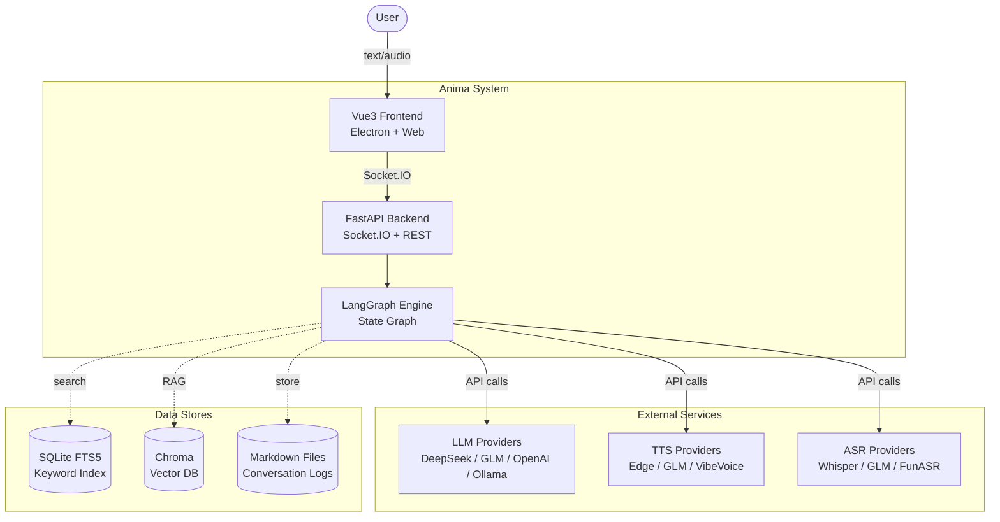
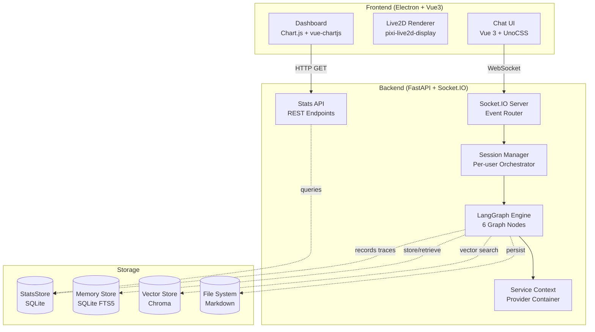
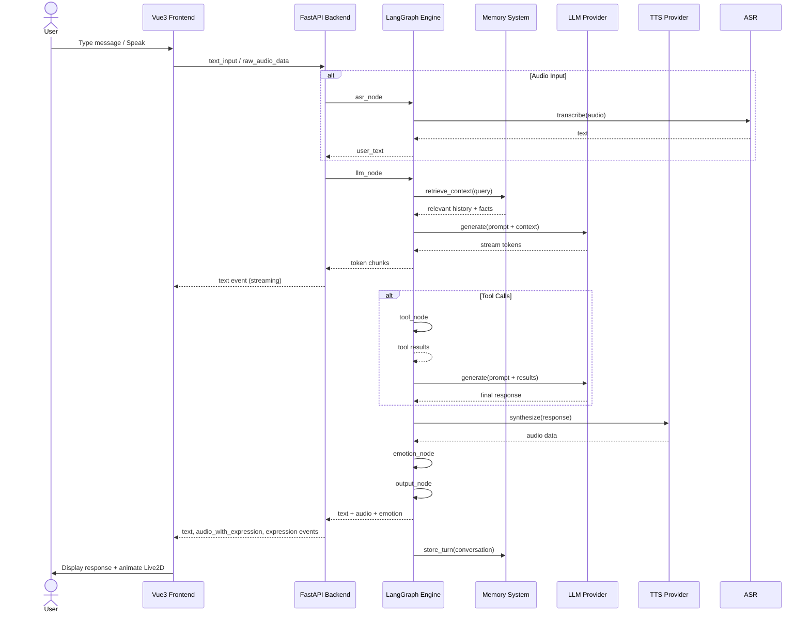
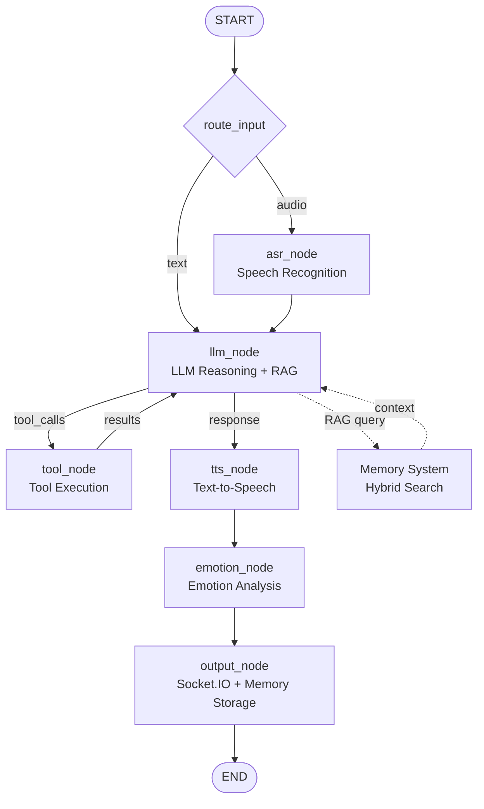

# Architecture

> For design decisions, see [Architecture Decision Records (ADRs)](docs/adrs/).

---

## System Context (C4 Level 1)



---

## Container Diagram (C4 Level 2)



---

## Sequence Diagram: Full Request Lifecycle



---

## LangGraph State Machine



### State: `AgentState` (TypedDict)

```
{
  input_type: "text" | "audio",
  raw_audio: Optional[bytes],
  user_text: str,
  messages: Sequence[BaseMessage],       # annotated with add_messages
  system_prompt: Optional[str],
  response_text: str,
  response_chunks: List[str],            # streaming tokens
  tts_audio: Optional[bytes | str],
  emotion: Optional[str],
  tool_calls: Optional[List[Dict]],
  tool_results: Optional[List[Dict]],
  session_id: str,
  metadata: Dict[str, Any],
}
```

---

## Core Components

### 1. LangGraph State Graph (`src/anima/orchestration/graph/`)

| Node | Input | Output | Responsibility |
|------|-------|--------|----------------|
| `asr_node` | `raw_audio` | `user_text` | Speech recognition via configured ASR provider |
| `llm_node` | `user_text`, `messages` | `response_text`, `tool_calls` | LLM reasoning + RAG memory injection |
| `tts_node` | `response_text` | `tts_audio` | Text-to-speech via configured TTS provider |
| `emotion_node` | `response_text` | `emotion` | Sentiment analysis (keyword + LLM-based) |
| `output_node` | all state | Socket.IO events | Distribution + memory storage |
| `tool_node` | `tool_calls` | `tool_results` | Tool execution (built-in + MCP) |

Two execution paths:
- **Direct**: `llm_node → tts_node → emotion_node → output_node`
- **Tool-calling**: `llm_node → tool_node → llm_node → ... → output_node`

### 2. Service Registry (`src/anima/config/core/registry.py`)

Decorator-based plugin system ([ADR-003](docs/adrs/ADR-003-plugin-architecture.md)):

```python
@ProviderRegistry.register_service("llm", "openai")
class OpenAILLM(LLMInterface): ...
```

Config-driven selection:
```yaml
services:
  agent: deepseek    # picks LLM provider
  tts: edge          # picks TTS provider
  asr: mock          # picks ASR provider
```

### 3. Memory System (`src/anima/memory/`)

Wiki-architecture ([ADR-005](docs/adrs/ADR-005-wiki-memory.md)) with three storage layers:

| Layer | Technology | Purpose |
|-------|-----------|---------|
| Short-term | In-memory (20 turns) | Recent conversation context |
| Long-term | Markdown files | Human-readable source of truth |
| Vector index | Chroma | Semantic search (70% weight) |
| Keyword index | SQLite FTS5 | BM25 keyword search (30% weight) |
| Fact store | SQLite | Structured memory with versioning |

Retrieval: **Hybrid search** ([ADR-002](docs/adrs/ADR-002-hybrid-search.md)) with weighted fusion:
```
score = 0.7 × vector_similarity + 0.3 × bm25_score
```

### 4. Tool System (`src/anima/tools/`)

Three tool sources:
- **Built-in**: `web_search`, `get_current_time`, `calculator`, `get_weather`
- **LangChain tools**: Python REPL, extensible via config
- **MCP tools**: Docker-sandboxed external servers via Model Context Protocol

### 5. WebSocket Server (`src/anima/orchestration/server/`)

FastAPI + Socket.IO ASGI app:
- Event-based communication (`text_input`, `raw_audio_data`, `interrupt_signal`)
- Session management (per-user orchestrator instances via `SessionManager`)
- Desktop client tracking (`DesktopClientManager`)
- Live2D action/motion control (`Live2DManager`)
- Stats REST API (`GET /api/stats/*`, `GET /health`)

---

## Data Flow (Text Input)

```
1. Client sends text_input via WebSocket
2. Route handler creates/gets session → LangGraphOrchestrator
3. Orchestrator runs state graph:
   a. llm_node: calls LLM, injects RAG memory context
   b. (optional) tool_node: executes tool calls, feeds back to LLM
   c. tts_node: synthesizes speech (if TTS enabled)
   d. emotion_node: extracts emotion from response
   e. output_node: emits events to frontend, stores to memory
4. Response streamed to client via Socket.IO events (text + audio + expression)
```

---

## Configuration Layering

```yaml
config/config.yaml       # User-facing settings (persona, services)
config/services.yaml     # Provider credentials and parameters
config/personas/         # Character personality definitions
config/tools.yaml        # Tool and MCP server configuration
.env                     # Secrets (API keys)
```

---

## Architecture Decision Records

| ID | Decision | Key Alternative |
|----|----------|-----------------|
| [ADR-001](docs/adrs/ADR-001-langgraph-over-eventbus.md) | LangGraph over EventBus | Direct orchestration, Message queue |
| [ADR-002](docs/adrs/ADR-002-hybrid-search.md) | Chroma + SQLite FTS5 | Pinecone, Weaviate, Pure vector |
| [ADR-003](docs/adrs/ADR-003-plugin-architecture.md) | Decorator-based plugin registry | Factory pattern, DI container |
| [ADR-004](docs/adrs/ADR-004-streaming-response.md) | Streaming-first design | Buffered response, Polling |
| [ADR-005](docs/adrs/ADR-005-wiki-memory.md) | Wiki-architecture memory | Buffer-only, Chroma-only |

---

## Ports

| Service | Port | Protocol |
|---------|------|----------|
| Backend | 12394 | Socket.IO + HTTP |
| Dashboard | 12394 | `GET /api/stats/*` |
| Web Config | 8080 | HTTP |
| Frontend | Electron | IPC |
