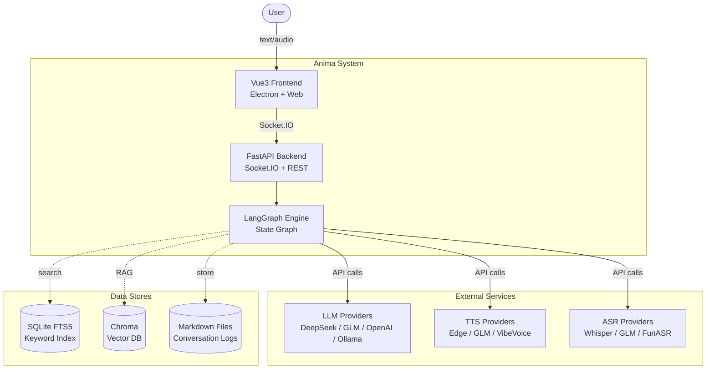

# Anima

<div align="center">


<!-- ↑ Replace with your demo GIF: record 15s of chat + Live2D interaction -->

**AI Virtual Companion with Live2D + Real-time Voice + LangGraph Orchestration** 🎭
> 不是套壳 ChatGPT。LangGraph 状态机编排 · 插件化 AI 模型 · 实时语音管线 · Wiki 记忆系统
> Not a ChatGPT wrapper. State machine orchestration · Plugin-based AI models · Real-time audio pipeline · Wiki memory

[](https://github.com/loiter74/Anima-LLM-Vtuber/actions/workflows/test.yml)
[](https://github.com/loiter74/Anima-LLM-Vtuber)


</div>

---

## ✨ 一眼看懂 | At a Glance

<div align="center">

| 🎭 | 💬 | 🔄 |
|:---:|:---:|:---:|
| **会动的虚拟角色** | **流式自然对话** | **换模型不改代码** |
| **Living Avatar** | **Streaming Chat** | **Swap Models Freely** |
| Live2D 角色根据对话内容 | Token 级流式输出 | 装饰器注册新 LLM/ASR/TTS |
| 改变表情和动作 | 边说边显示，像真人聊天 | 无需修改框架代码 |
| Reacts with expressions & gestures | Stream output token by token | Register via `@ProviderRegistry` |

</div>

---

## 🚀 快速开始 | Quick Start

```bash
pip install -r requirements.txt    # 安装依赖 | Install
cp .env.example .env               # 配置 API Key | Configure
python scripts/start.py            # 启动 | Launch
```

打开桌面应用，开始和你的 AI 角色聊天吧！ | Open the desktop app and start chatting!

---

## 🎮 能力矩阵 | Capability Matrix

### 🤖 AI 模型支持 | AI Models

| 类型 Type | 支持的服务 Providers |
|-----------|---------------------|
| **LLM** 大语言模型 | DeepSeek · GLM · OpenAI · Ollama · 本地模型 Local |
| **ASR** 语音识别 | FasterWhisper · GLM · OpenAI · FunASR |
| **TTS** 语音合成 | Edge TTS · ChatTTS · GPT-SoVITS · Kokoro · GLM · OpenAI · VibeVoice |
| **VAD** 语音检测 | Silero VAD |

### 🎭 角色表现 | Character Features

| 功能 Feature | 说明 Description |
|-------------|-----------------|
| **表情同步** Expression Sync | 情绪驱动 Live2D 面部表情 / Emotion-driven facial expressions |
| **口型同步** Lip Sync | 语音与嘴型精确匹配 / Audio-driven viseme matching |
| **🎬 双语字幕** Bilingual Subtitles | 萌系泡泡风格，LLM 实时翻译，支持英日韩法德西俄 / Anime-style overlay with LLM translation (EN/JA/KO/FR/DE/ES/RU) |
| **自定义人设** Persona | 创建独一无二的角色性格 / Create unique character personalities |

### 🚀 扩展能力 | Extensions

| 功能 Feature | 说明 Description |
|-------------|-----------------|
| **🔧 工具调用** Tool Calling | LLM 可调用计算器、网页搜索、MCP 协议工具 / Calculator, web search, MCP protocol tools |
| **🎮 Minecraft 游戏** Gameplay | Mineflayer 机器人，AI 操控角色挖掘、建造、战斗 / AI controls a Minecraft bot via LangChain tools |
| **📺 B站直播** Livestream | 实时弹幕接入，AI 与观众互动回复 / Bilibili danmaku integration, AI responds to live comments |
| **📊 数据看板** Dashboard | 对话统计、延迟分布、Token 用量可视化 / Conversation stats, latency distribution, token usage charts |

---

## 🏗️ 系统架构 | Architecture

### C4 系统上下文 | System Context



### 🔄 请求全链路 | Request Lifecycle

```
User Input (Text / Audio)
    ↓
[START] → route_input()
    │
    ├── (audio) → [asr_node] → Speech Recognition → user_text
    │
    └── (text) ──────────────────→ [llm_node]
                                       │
                                   RAG: Retrieve Memory Context
                                       │
                                   LLM Reasoning (Streaming / Tools)
                                       │
                              ┌────────┴────────┐
                              │                 │
                        (Tool Calls)      (Direct Reply)
                              │                 │
                         [tool_node]      [tts_node]
                              │                 │
                       Execute Results ←─────────┤
                                                ↓
                                          [emotion_node]
                                                ↓
                                          [output_node]
                                     ┌──────────┴──────────┐
                                     ↓                     ↓
                             Socket.IO Events        Memory Storage
                               → Frontend           → SQLite / Chroma
```

### 🧩 LangGraph 状态机 | State Machine

7 个节点 + 条件边，全流式，可中断 | 7 nodes + conditional edges, streaming-first, interruptible:

```
START → route_input ─┬─ audio → ASR ─┐
                      └─ text ────────┤
                                      ↓
                      LLM ←─ Tool ──→ LLM    (RAG: Hybrid Search)
                                      ↓
                               TTS → Emotion → Output → END
```

### 🔌 插件架构 | Plugin Architecture

开放-封闭原则：新增 LLM/ASR/TTS 只需写一个类 + 一行装饰器，**零框架代码改动** | Add a provider with one class + one decorator, zero framework changes:

```
interface.py (ABC)
    ↓ implements
glm_llm.py, openai_llm.py, deepseek_llm.py ...
    ↓ @ProviderRegistry.register_service
factory.py → __init__.py (统一导出 | unified re-export)
```

### 🧠 记忆系统 | Memory System

```
Hybrid Search (ADR-002)         Wiki Memory (ADR-005)        Periodic Learner
70% Vector + 30% BM25     →    Markdown = Source of Truth → Auto-extract knowledge
Chroma + SQLite FTS5          可审计 · 可版本控制              写入 Wiki 知识库
                               Auditable · Versionable       Writes to Wiki KB
```

**深度特性 | Deep Features:**
- **FuzzyLayer** 分级记忆注入：上下文层 → 支撑层 → 精确层，按相关性逐级注入 LLM 上下文
- **MemePool** 时间衰减记忆池：10 个活跃槽位，半衰期衰减 + 复活机制 + AI 自动发现梗
- **UserProfile** 双轨用户画像：静态画像（Wiki 长期事实）+ 动态画像（当前对话上下文）

---

## 📐 工程实践 | Engineering

### 架构决策记录 | Architecture Decision Records

5 个正式 ADR，所有架构决策有据可查 | 5 formal ADRs documenting all key architectural decisions:

| ID | 决策 Decision | 要点 Highlight |
|----|--------------|----------------|
| [ADR-001](docs/adrs/ADR-001-langgraph-over-eventbus.md) | LangGraph 替代 EventBus | 状态机编排 > 事件驱动 / State machine > event-driven |
| [ADR-002](docs/adrs/ADR-002-hybrid-search.md) | Chroma + SQLite 混合搜索 | 70/30 向量+关键词融合 / Vector + keyword fusion |
| [ADR-003](docs/adrs/ADR-003-plugin-architecture.md) | 装饰器插件注册 | 开放-封闭原则 / Open-closed principle |
| [ADR-004](docs/adrs/ADR-004-streaming-response.md) | 流式响应优先 | Token 级流式，全链路 / End-to-end streaming |
| [ADR-005](docs/adrs/ADR-005-wiki-memory.md) | Wiki 记忆架构 | Markdown=真实来源 / Markdown as truth source |

### 工程指标 | Engineering Metrics

| 指标 Metric | 状态 Status |
|-------------|-------------|
| **测试 Tests** | 81 passing · pytest + pytest-asyncio |
| **CI/CD** | GitHub Actions · Python 3.12/3.13 矩阵 |
| **类型安全 Type Safety** | mypy strict mode |
| **代码规范 Lint** | ruff |
| **可观测性 Observability** | OpenTelemetry 全链路追踪 + Stats API + 数据看板 |
| **代码规模 Code Scale** | 202 files · ~30K lines Python |
| **容器化 Container** | Docker + docker-compose |

```bash
# 测试 | Tests
PYTHONPATH=src python -m pytest tests/ -v
PYTHONPATH=src python -m pytest tests/ --cov=src/anima --cov-report=term-missing

# 类型检查 + 代码规范 | Type check + Lint
mypy src/ --ignore-missing-imports
ruff check src/ tests/
```

---

## 📦 部署 | Deployment

```bash
# Docker 一键部署 | One-command deploy
docker-compose up --build -d

# 健康检查 | Health check
curl http://localhost:12394/health
```

---

## 📖 文档导航 | Documentation

| Document | Description |
|----------|-------------|
| [ARCHITECTURE.md](ARCHITECTURE.md) | 系统架构总览 + C4 图 + 时序图 / System Architecture |
| [TESTING.md](TESTING.md) | 测试指南 / Testing Guide |
| [CONTRIBUTING.md](CONTRIBUTING.md) | 贡献指南 / Contributing Guide |
| [docs/adrs/](docs/adrs/) | 5 个架构决策记录 / 5 Architecture Decision Records |
| [docs/plans/](docs/plans/) | 工程升级计划 / Engineering Upgrade Plans |

---

## 📂 项目结构 | Project Structure

```
src/anima/                  # Python backend (202 files, 30K lines)
├── core/                   # Entry point + service container
├── orchestration/          # LangGraph state graph + WebSocket server
│   ├── graph/              # 7 nodes + builder + orchestrator
│   └── server/             # Socket.IO routes + session management
├── services/               # LLM / ASR / TTS / VAD implementations
│   ├── speech/{asr,tts}/   # Provider interface → impl → factory pattern
│   ├── intelligence/{llm,vad}/
│   └── live/               # Bilibili danmaku livestream integration
├── memory/                 # Wiki-architecture memory (Chroma + SQLite FTS5)
│   ├── search/             # Hybrid search (70% vector + 30% BM25)
│   ├── wiki/               # Markdown knowledge base
│   └── learner/            # Periodic pattern extraction
├── config/                 # Pydantic configs + @ProviderRegistry
├── avatar/                 # Live2D expression analysis
│   ├── analyzers/          # Emotion extraction (keyword + LLM)
│   ├── mappers/            # Emotion → Live2D parameter mapping
│   └── strategies/         # Duration/intensity/position strategies
├── tools/                  # Tool calling + MCP bridge + Minecraft bot
│   ├── base.py             # Built-in tools (calculator, web search)
│   ├── mcp_bridge.py       # MCP protocol bridge
│   └── minecraft/          # Mineflayer bot gameplay integration
└── tracing/                # OpenTelemetry observability
frontend/                   # Vue 3 + TypeScript + Electron (UnoCSS, Pinia)
```

---

## 📄 许可证 | License

MIT License — 自由使用、修改和分发 | Free to use, modify, and distribute.

---

<div align="center">
<sub>Built with ❤️ by the Anima team</sub>
</div>
