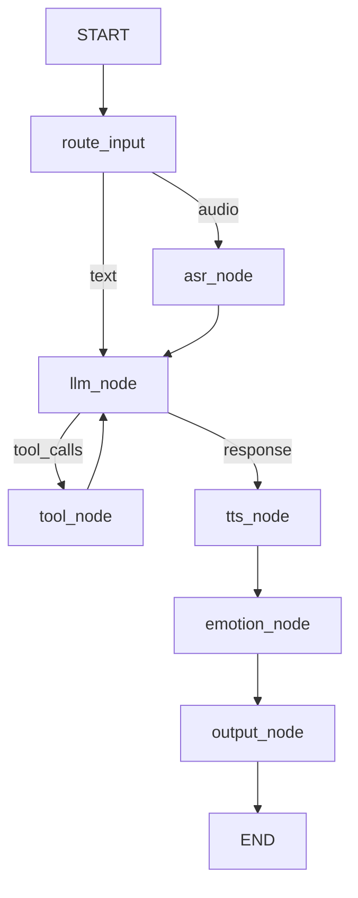

# ADR-001: LangGraph over EventBus

**Date:** 2026-05-01
**Status:** Accepted

## Context

Anima's dialogue orchestration originally used an EventBus-based pipeline. Each processing step (ASR, LLM, TTS, emotion analysis, output) subscribed to events and emitted results. This architecture had several limitations:

1. **Invisible state**: The pipeline's internal state could only be inferred from emitted events — no explicit state machine.
2. **No branching**: All events flowed through a linear pipeline. Branching (e.g., tool calls feeding back into LLM) required fragile workarounds.
3. **Difficult debugging**: Without explicit state transitions, tracing a conversation's path through the system required instrumenting every event handler.
4. **No streaming support**: EventBus naturally supported one-shot messages, but streaming token-by-token responses required separate machinery.

## Decision

Replace the EventBus pipeline with a **LangGraph state graph**. The graph explicitly defines states, transitions, and branching:

Key design choices:

- **AgentState (TypedDict)**: All node inputs/outputs flow through a single typed state object, ensuring type safety and clear data flow.
- **`add_messages` reducer**: LangGraph's built-in message accumulation handles conversation history.
- **ConfigStore pattern**: External dependencies (service_context, Socket.IO) are injected via a thread-safe singleton rather than passed through state.
- **Streaming via `astream`**: LangGraph's native streaming support enables token-by-token output.

## Consequences

**Positive:**
- State transitions are explicit and testable — each node takes state and returns state updates.
- Branching (tool calls → LLM re-entry) is a first-class graph pattern.
- Streaming is natively supported via LangGraph's event streaming.
- Each node can be unit tested in isolation with mocked state.

**Negative:**
- More boilerplate than EventBus (state definition, graph builder, node functions).
- Steeper learning curve for contributors unfamiliar with LangGraph.
- Runtime overhead from state serialization (negligible in practice).

## Alternatives Considered

| Alternative | Reason for Rejection |
|-------------|---------------------|
| **EventBus (original)** | No state visibility, no branching, no streaming support |
| **Direct function orchestration** | Tight coupling, no visualizable pipeline, hard to add new steps |
| **Celery / task queue** | Overkill for single-process app; adds Redis/RabbitMQ dependency |
| **State machine library (transitions)** | Python-only, no built-in streaming or LangChain integration |
