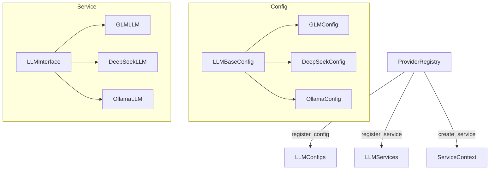

# ADR-003: Plugin-Based Provider Architecture

**Date:** 2026-05-01
**Status:** Accepted

## Context

Anima supports multiple LLM, ASR, TTS, and VAD providers. Users should be able to:

1. Switch providers at runtime via config change (e.g., from DeepSeek to GLM-4).
2. Add new providers without modifying core framework code.
3. Mix providers (DeepSeek LLM + Edge TTS + FasterWhisper ASR).
4. Have providers auto-discover and register themselves.

## Decision

Implement a **decorator-based plugin registry** (`ProviderRegistry`) with Pydantic discriminated unions:

Key design choices:

- **`@ProviderRegistry.register_config("llm", "glm")`** decorator registers a config class with a type tag.
- **`@ProviderRegistry.register_service("llm", "glm")`** decorator registers the corresponding service implementation.
- **Pydantic Discriminated Unions** (`Literal["glm"]` type field) enable automatic config deserialization based on the type field.
- **`create_service(config)`** uses the type tag to look up and instantiate the correct service.
- **Graceful degradation**: If a provider fails to load, the system falls back to a mock implementation.

## Consequences

**Positive:**
- Adding a new provider requires only two files (config class + service class) and two decorators — no framework changes.
- Providers can be optional dependencies (e.g., `zhipuai` SDK is only needed when using GLM).
- Discriminated unions provide compile-time type safety for config deserialization.
- The `list_providers()` and `is_registered()` methods enable runtime provider discovery.

**Negative:**
- Decorator-based registration is implicit — providers must be imported to register.
- Circular imports can occur if not carefully managed (solved by lazy imports in `__init__.py`).
- Pydantic discriminated unions require `Literal` type fields, adding slight boilerplate.

## Alternatives Considered

| Alternative | Reason for Rejection |
|-------------|---------------------|
| **Simple factory with if/elif** | Violates Open/Closed principle; requires changes to factory for each new provider |
| **Dependency injection container** | Heavy for this use case; adds a DI framework dependency |
| **Entry points (setuptools)** | Requires package installation; doesn't work for optional providers |
