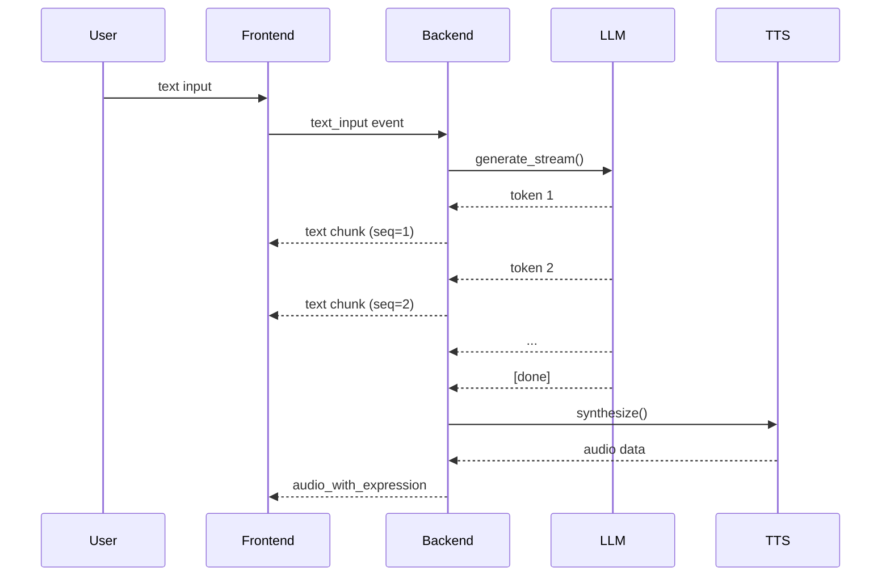

# ADR-004: Streaming-First Response Design

**Date:** 2026-05-01
**Status:** Accepted

## Context

Anima's user experience requires real-time feedback during conversation. Users should see the AI's response as it's being generated, not wait for the complete response. The system must support:

1. **LLM token streaming**: Display text tokens as they arrive from the LLM.
2. **TTS audio streaming**: Begin audio playback before TTS generation is complete.
3. **Progressive UI updates**: Show intermediate states (transcript, emotion, audio) as they become available.
4. **Interruption handling**: Users must be able to interrupt the AI mid-response.

## Decision

Design the entire pipeline around **streaming-first** principles:

Key design choices:

- **LangGraph `astream`**: The graph processes each node and streams state updates back to the orchestrator.
- **Socket.IO events**: Each output type (text, audio, emotion) is sent as a separate event with a sequence number.
- **`response_chunks` in AgentState**: Accumulates streamed tokens for downstream nodes (TTS, emotion).
- **Interrupt via `asyncio.Event`**: Per-session interrupt signal is checked at the start of each graph node.
- **Stateless TTS**: TTS node waits for full LLM response (not streaming), then synthesizes synchronously — simplifies audio pipeline while maintaining acceptable latency.

## Consequences

**Positive:**
- Users see text appear in real-time, creating a responsive feel.
- Audio playback can begin while text is still streaming.
- Interruption is clean — the graph stops at the next node boundary.

**Negative:**
- Streaming adds complexity to the graph execution model.
- TTS cannot begin until LLM completes (sequential dependency).
- Frontend must handle partial state updates gracefully.

## Alternatives Considered

| Alternative | Reason for Rejection |
|-------------|---------------------|
| **Buffered (full response then output)** | Poor UX — users wait 1-3s before seeing any response |
| **WebSocket raw streaming** | More flexible but requires custom protocol; Socket.IO is already in the project |
| **SSE (Server-Sent Events)** | Unidirectional; doesn't support bidirectional communication needed for audio input |
