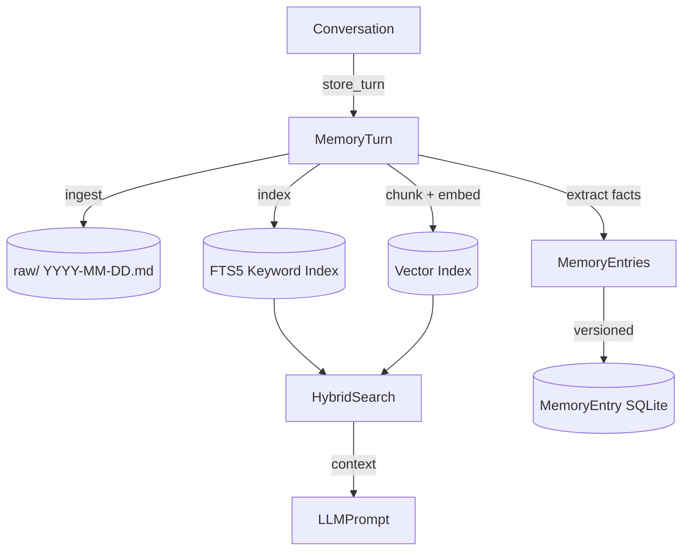

# ADR-005: Wiki-Architecture Memory System

**Date:** 2026-05-01
**Status:** Accepted

## Context

Anima needs a long-term memory system that:

1. **Persists across sessions**: Conversations yesterday should inform responses today.
2. **Supports both factual and episodic memory**: "The user's name is Alice" (fact) vs "We talked about Python last time" (episode).
3. **Allows human inspection**: Memory content should be readable and editable.
4. **Scales to months of conversations**: Must handle thousands of conversation turns efficiently.
5. **Supports different retrieval modes**: Semantic search, keyword search, and recent context.

## Decision

Implement a **wiki-architecture memory system** inspired by Karpathy's approach:

Storage layers:

| Layer | Technology | Purpose |
|-------|-----------|---------|
| **Short-term** | In-memory (configurable 20 turns) | Recent conversation context |
| **Markdown files** | `memory/raw/` and `memory/wiki/` | Human-readable source of truth |
| **Vector index** | Chroma (cosine similarity) | Semantic search (70% weight) |
| **Keyword index** | SQLite FTS5 | BM25 keyword search (30% weight) |
| **Fact store** | SQLite (MemoryEntry) | Structured factual memory with versioning |

Key design choices:

- **Markdown as source of truth**: Chroma and SQLite indexes are derived from Markdown and can be rebuilt.
- **Fact extraction**: An LLM-based extractor identifies atomic facts from conversations and stores them with version chains.
- **User profile**: Aggregated user preferences and traits derived from memory entries.
- **Wiki organization**: AI-suggested reorganization of memory into entities, concepts, and synthesis pages.

## Consequences

**Positive:**
- Human-readable and editable memory (open a Markdown file to see all conversations).
- Indexes can be rebuilt from source without data loss.
- Hybrid search quality significantly outperforms single-strategy retrieval.
- Fact versioning enables history tracking of user preferences.

**Negative:**
- Three storage systems to maintain (filesystem, Chroma, SQLite).
- Fact extraction adds LLM API cost per conversation turn.
- Wiki reorganization requires LLM calls and file system writes.

## Alternatives Considered

| Alternative | Reason for Rejection |
|-------------|---------------------|
| **Conversational buffer only** | Loses all context between sessions |
| **Chroma-only vector memory** | No keyword search for exact recall; no human-readable format |
| **SQLite-only relational memory** | Poor semantic search; schema rigid for diverse memory types |
| **External memory service (Mem0, MemGPT)** | External dependency, API cost, data privacy concerns |
