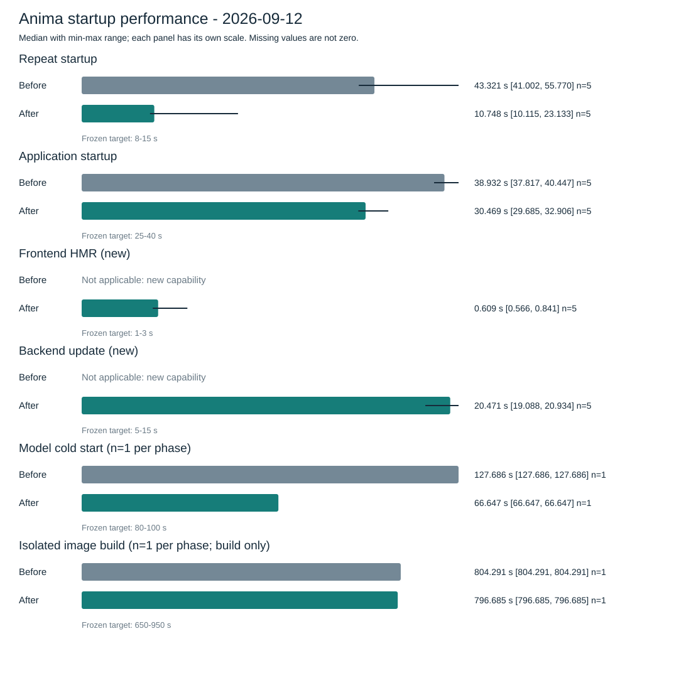

# Anima 一键启动优化与性能分析

此前阻止测量的 Docker Desktop 存储初始化故障已恢复。相同条件下各五次实测，最终版本重复启动中位数从 **43.32 秒降到 10.75 秒（减少 75.2%，4.03 倍）**，应用启动从 **38.93 秒降到 30.47 秒（减少 21.7%，1.28 倍）**，中位数均落入原预测。重复启动有一次浏览器验收较慢，总等待达到 23.13 秒，因此不能承诺每次都在 15 秒内完成。新增开发能力中，前端 HMR 中位数 **0.61 秒**，后端同步重启 **20.47 秒**，后者未达到原定 5–15 秒。严格冷构建为 **804.29 → 796.68 秒**，仅减少约 **0.95%**，每侧一次应视为基本持平。实际 `start-anima.cmd` 和最终正式入口冒烟均通过。基线为“原版加公共就绪修复”，保留了未经改造的独立源码快照。此前环境恢复的 606 秒和本轮诊断过程均不计入应用样本。

## 1. 测量条件与复现步骤

原版提交为 `a016e6c2fa7926bf94b2e7aa849d6f4fcc1ddaf9`，983 个原版输入文件的快照指纹为 `a9740e2e1fb1a252e024639165fac39a4c138bca442b5feb3b1cbe6083d46afe`。原版保存在相邻目录 `Anima-baseline-20260912`，实施修改没有写入这份快照。快照包含当时工作区输入，不把 Git 提交号单独当作实际源码身份。

优化侧采样也发生在提交前，所以原始元数据的 `revision` 仍是当时 HEAD；同时记录了 `source_snapshot`、`working_diff_sha256` 和镜像内容身份。相同 HEAD 不代表源码相同，正式样本通过实际镜像摘要和资源指纹确认所运行的优化版本。报告等非镜像输入的后续整理不改变已冻结的应用源码。

引擎恢复后，未修改原版的构建成功，但完整就绪因上游模型清单别名变化而失败。官方 API 清单返回 `deepseek-flash`，使用原配置 `deepseek-v4-flash` 的最小生成请求却成功（HTTP 200，返回模型 `deepseek-flash`，5 个输入 token、1 个输出 token）。因此成功对比使用单独的 `Anima-baseline-repaired-20260912`：在原版 983 个输入中，仅 `src/animetta/runtime/session_context.py` 应用与优化版完全相同的就绪修复。原请求模型、功能配置和其他启动逻辑不变；不能将该基线标为“未经修复的原版”。[公共补丁与源码身份](../../artifacts/runtime-recovery-20260912/repaired-baseline-snapshot.json) 保留逐文件指纹，原始快照仍不变。

机器：Windows 11 Pro 10.0.26200，i5-14600KF（14 核/20 线程），31.78 GiB RAM，RTX 5090 D v2。启动前 GPU 总显存 24455 MiB、已用 5462 MiB、空闲 18574 MiB（厂商显示值分别记录，不把总量当空闲量）。Python 3.13.14，Docker Desktop 4.81.0，Compose 5.2.0。

使用当前 `production` 功能配置，宿主 Qwen/RVC 环境与模型文件已经存在，起始时两项模型进程均未运行。原版测量项目为 `anima-perf-before`，HTTP 80、后端 12394（前后项目顺序使用），镜像、容器和数据卷与正式项目隔离。此前环境准备过程中出现一次外部 Docker GUI 恢复出厂事件；本轮修复后实际检查镜像、容器、卷均为 0，Buildx 缓存为 0 B，因此先准备缓存，不将该过程计为热启动。

恢复后的 Docker Engine 为 29.6.1、Linux x86_64，虚拟机可用 10 CPU、10428829696 字节内存。Docker 数据实际位于 `E:\DockerDesktop\wsl`，底层为 WDC WD5000AAKX-60U6AA0 SATA 机械硬盘；源码位于 C 盘。保持该存储条件不变。首次解包及安装大量小文件可能受磁盘影响，下载则另受网络影响，不能将两者笼统归因于启动代码。

原始环境记录、完整文件清单及 26 条带来源行号的 Docker 错误摘录在 `artifacts/startup-performance/`。可版本化的 [JSON](startup-results-2026-09-12.json) 内嵌每次有效样本、生命周期阶段及页面资源指纹；[CSV](startup-results-2026-09-12.csv) 保留逐样本阶段耗时，因此主要测量数据不依赖未入库的 `artifacts/`。秘密配置不写入报告；测量驱动只记录其哈希、存在性及功能 profile。

### 恢复后的测量顺序

先通过 Docker Desktop 自身诊断修复存储初始化，确认 `docker info` 可用。不得为采样删除用户缓存、注销 WSL 分发或删除 VHDX。原版准备成功后再记录暖缓存基线，然后实施版在相同 profile、模型身份、验收条件和驱动版本下复测。

流程存在一项偏差：环境最初阻塞时实现已推进，当前有效完整基线是在环境恢复后，用冻结的原版快照补测。因此本报告的“优化前”指原版源码的实测，不表示所有采样都发生在代码修改之前；原始预测保持原样，快照与公共修复边界单独留证。后续性能任务仍按项目指南要求先取得可用基线，再改运行行为，避免再次依赖事后回放。

```powershell
py -3.13 -c "import sys; assert sys.version_info >= (3, 13)"
# 从主工作区执行同一个测量驱动；第一次只准备暖环境，不算重复启动样本。
py -3.13 scripts/benchmark_startup.py measure --root ..\Anima-baseline-repaired-20260912 --env-file .env --phase before --scenario repeat --samples 1 --project anima-perf-before --http-port 80 --backend-port 12394 --output artifacts/startup-performance/before-prepare
py -3.13 scripts/benchmark_startup.py measure --root ..\Anima-baseline-repaired-20260912 --env-file .env --phase before --scenario repeat --samples 5 --project anima-perf-before --http-port 80 --backend-port 12394 --output artifacts/startup-performance/before-repeat
py -3.13 scripts/benchmark_startup.py measure --root ..\Anima-baseline-repaired-20260912 --env-file .env --phase before --scenario application --samples 5 --project anima-perf-before --http-port 80 --backend-port 12394 --output artifacts/startup-performance/before-application
```

优化版用 `--root . --phase after --project anima-perf-after`，顺序复用 HTTP 80/后端 12394；切换前通过规范入口停止上一测量项目，按同样顺序先准备后取样。自定义端口必须已经列入当前安全配置允许的 Origin，不伪造请求来源或关闭 CORS。两边都由父进程单调时钟测量实际等待，子进程记录生命周期阶段和续跑等待，后台构建单独记录真实起止时间。应用场景的准备使用原版已有 `anima-down`，因此会停止应用与该测量项目 Redis；两版条件相同，宿主模型保留。准备阶段耗时不混入每个应用样本。

每次成功样本必须完成 `/health`、带鉴权的完整 `/ready`、`/dashboard`、`/live.html`、直播页真实 Socket.IO 连接和 Live2D 就绪。浏览器复用已有机器令牌，验证 `/api/auth/session` 的真实鉴权结果，并将请求限制在被测 origin，避免凭证发往外部资源。浏览器记录所请求脚本的内容指纹、控制台错误、页面异常和失败请求。启动浏览器及页面验收成本计入总等待，并另列 `browser` 阶段；HTML HTTP 200 不单独算页面可用。控制台发生错误或验收失败时不统计为成功样本。

首次构建先创建专用空 BuildKit builder，例如 `docker buildx create --name anima-perf-cold-before --driver docker-container --driver-opt default-load=true`，核查 `docker buildx du --builder anima-perf-cold-before` 为空，再使用 `--scenario cold-build --builder anima-perf-cold-before --samples 1` 和全新独立项目/镜像标签。优化后使用另一个全新 builder。不得 `prune` 或复用已经测过的 builder；先确认宿主模型健康，以免混入冷加载。模型冷启动使用 `--scenario model-cold --samples 1`，执行前由唯一运行时操作者确认没有其他任务使用共享宿主模型，并记录 GPU 进程归属；驱动会通过规范生命周期停止两项宿主模型后启动。

严格冷构建实际使用两个独立 `docker-container` builder，固定 BuildKit **v0.32.2** 镜像 `moby/buildkit@sha256:28a898719c18a33f4e8000685287fa36fd0dd9560c6440227d3a732d79bb41d8`，按照 [Docker driver 文档](https://docs.docker.com/build/builders/drivers/) 开启 `default-load=true`，构建后将镜像载入本地引擎；缓存使用[独立状态卷](https://docs.docker.com/build/builders/drivers/docker-container/)，未切换用户默认 builder。暖场景使用 Docker 自带 BuildKit v0.31.1；只在相同场景与 builder 版本内比较。原版 builder 准备约 **62.2 秒**，其中镜像解析 2.318 秒、创建 0.199 秒、拉取及 bootstrap 59.423 秒、空缓存检查 0.285 秒；这属于测量环境准备，另列在应用样本之外。bootstrap 曾返回一次 inspect deadline 文本，随后独立 `du` 确认总缓存 0 B、容器正常，才开始实际构建。

优化版 builder 使用不同专用卷，bootstrap **17.189 秒**，此时 BuildKit 引擎镜像已经存在于宿主缓存，但新 builder 内部构建缓存仍为 **0 B**，没有导入原版缓存。两边 bootstrap 成本均在样本外单独记录，不能把这一准备时间差计作应用优化收益。

### 开发更新测量（新增能力）

```powershell
py -3.13 scripts/runtime_lifecycle.py anima-dev --wait
# 测量入口自动加载 .env，并选择相同的独立开发项目。
py -3.13 scripts/benchmark_startup.py update --env-file .env --mode frontend --url http://localhost:3000 --samples 5 --output artifacts/startup-performance/after-frontend.json
py -3.13 scripts/benchmark_startup.py update --env-file .env --mode backend --url http://localhost:3000 --samples 5 --output artifacts/startup-performance/after-backend.json
```

前端探针在现有 App.vue 中临时追加一个可观察 CSS 属性，等待浏览器实际应用，并确认页面没有重载。后端探针临时追加 Python 注释，等待容器启动时间变化、源码内容匹配、完整就绪及 Socket.IO 重连。两者均确认镜像 ID 没变，恢复原文件并等待恢复完成；若检测到并发编辑，拒绝覆盖用户新内容。计时期间不要编辑这两个目标文件。首次运行需要已有 Playwright 浏览器环境。

```powershell
py -3.13 scripts/benchmark_startup.py compare --before artifacts/startup-performance/before-repeat/summary.json --after artifacts/startup-performance/after-repeat/summary.json --predictions docs/performance/startup-predictions-2026-09-12.json --output artifacts/startup-performance/repeat-comparison.json
```

比较入口生成 JSON、CSV、Markdown 和 SVG。它拒绝驱动版本、功能配置、平台或场景不一致的比较；缺少成功样本时不生成降幅。构建阶段由 BuildKit 日志解析依赖安装、编译和镜像导出；并行阶段不能相加冒充墙钟时间。续跑等待与构建可能重叠，分别列出。用户响应和工具调度发生在采样父进程外，不计入应用样本。

## 2. 优化前实测

| 场景 | 成功样本/要求 | 中位数 | 最小—最大 | 状态 |
| --- | ---: | --- | --- | --- |
| 重复启动 | 5/5 | 43.321 秒 | 41.002–55.770 秒 | 原版加公共就绪修复；完整验收通过 |
| 应用启动 | 5/5 | 38.932 秒 | 37.817–40.447 秒 | 同上；停止应用和项目 Redis 后启动 |
| 普通前端更新 | 不适用 | 不适用 | 不适用 | 原版没有对应容器 HMR 能力 |
| 普通后端更新 | 不适用 | 不适用 | 不适用 | 原版没有对应 Watch 能力 |
| 完整应用含宿主冷启动 | 1/1 | 127.686 秒 | 单样本，最小/最大均同此值 | 应用、项目 Redis 与两个宿主模型先停止，镜像/依赖缓存保留 |
| 隔离缓存首次镜像构建 | 1/1 | 804.291 秒 | 单样本，最小/最大均同此值 | 真实 build receipt 有效；端到端启动计时因中断缺测 |

重复启动的五次墙钟为 55.770、43.848、42.072、43.321、41.002 秒；应用启动为 38.932、39.201、38.803、37.817、40.447 秒。原版暖构建中位数分别为 9.973 秒和 9.406 秒。重复启动每次仍调用构建，随后 `compose up --no-build` 的五次日志均记录应用容器被重新创建。镜像配置摘要保持相同，但每次构建生成的 attestation 和 manifest-list 摘要变化；这些记录支持消除重复构建与容器重建的优化方向。原始样本在 [重复启动](../../artifacts/runtime-recovery-20260912/before-repeat/summary.json)、[应用启动](../../artifacts/runtime-recovery-20260912/before-application/summary.json)，镜像变化证据在 [缓存行为记录](../../artifacts/runtime-recovery-20260912/before-repeat-cache-behavior.json)。

下表按每个样本的相同阶段先求和，再取五次中位数。`check_logs` 已包括内部日志命令，不能再叠加一次 `run_command logs`。阶段中位数来自不同样本，且续跑等待与后台构建重叠，整列不能相加。

| 阶段中位数（秒） | 原版重复启动 | 优化重复启动 | 原版应用启动 | 优化应用启动 |
| --- | ---: | ---: | ---: | ---: |
| 宿主检查及身份 preflight | 2.437 | 2.475 | 2.288 | 2.386 |
| 后台实际构建 | 9.973 | 0（跳过） | 9.406 | 0（跳过） |
| 实例复用核对或 Compose 容器启动 | 16.107 | 1.447 | 12.192 | 12.510 |
| HTTP 健康、完整就绪及首页 | 10.074 | 0.036 | 10.056 | 8.732 |
| 真实浏览器页面及连接验收 | 2.058 | 2.104 | 2.163 | 2.084 |
| 当前日志检查 | 0.231 | 0.244 | 0.274 | 0.312 |
| 自动续跑等待（与构建重叠） | 7.046 | 0 | 7.048 | 0 |

历史三次启动记录总跨度 55.9、70.4、121.5 秒，构建层均命中缓存，但含不同长度的人工续跑间隔，且缺少当前完整 `/ready` 终点，因此不能作为本次基线。静态定位发现原入口每次都调用构建、续跑需外部再次触发、源码未进入完整构建身份，以及 ASGI 启动入口额外创建了一份不用的服务对象。

恢复后原版缓存准备 `b-32498140009c` 的后台构建成功，单调耗时 **1568.349 秒**，开始 `12:17:23.426Z`、结束 `12:43:31.776Z`。生命周期总墙钟 **1872.060 秒**，因 `/ready` 等待 240 秒后失败，成功样本仍为 0。这不是首次构建的严格隔离样本：前一次失败准备已下载部分基础镜像；也不是热启动样本。只将其用作阶段诊断：

| 缓存准备阶段 | BuildKit 耗时 | 解释 |
| --- | ---: | --- |
| runtime apt | 515.2 秒 | 系统包下载、解包与配置 |
| builder gcc apt | 612.4 秒 | 包含约 515 秒共享 apt 缓存锁等待，不能与上一行相加 |
| Python pip | 808.1 秒 | 原版依赖下载与安装，部分下载约 87–147 KB/s |
| 前端 pnpm | 25.3 秒 | 安装依赖 |
| Vite | 10.2 秒 | 编译前端 |
| 镜像导出 | 67.8 秒 | layers 导出 |

各阶段并行或等待，不能相加替代后台构建墙钟。原始 [构建 receipt](../../artifacts/runtime-recovery-20260912/before-cache-prepare/sample-01-build.json) 与 [完整失败样本](../../artifacts/runtime-recovery-20260912/before-cache-prepare/summary.json) 分开保存。

另通过原版 `host-tts-up`、`host-rvc-up` 顺序采集各一次独立宿主阶段，均从进程停止、模型文件已存在的状态开始，未清空 OS 文件缓存。运行前确认无其他活动任务或训练进程使用模型，完成后保留两服务健康运行。

| 原版独立阶段 | 外部单调墙钟 | 生命周期内 | 加载并就绪 | 身份 preflight |
| --- | ---: | ---: | ---: | ---: |
| Qwen TTS | 35.978 秒 | 35.290 秒 | 34.920 秒 | 0.330 秒，通过 |
| RVC | 17.745 秒 | 17.153 秒 | 16.775 秒 | 0.325 秒，通过 |

两个独立命令的外部耗时相加为 **53.724 秒**，加载段合计 **51.695 秒**；调用之间的工具调度空档不计入这个加和。它不是一条完整应用启动测量，不能与历史总跨度比较。两阶段各 n=1，最小/最大均等于该次值，不代表稳定波动范围。原始 `before-host-cold-stages.json/.csv` 保存完整模型身份、GPU 状态和 run ID；Qwen revision 为 `0eb32e283ee46b86820c67843abb04cf12bc58d7`，RVC revision 为 `e2714bf076547117a24352943cb67d7766d6b512a163c4ecd26bd1e6abb54536`。

随后原版完整模型冷启动 `b-0a994db381a7` 实测 **127.686 秒**，其中 Qwen 启动 16.543 秒、RVC 启动 19.338 秒、后台构建 51.219 秒、容器启动 15.529 秒、HTTP 检查约 20.086 秒、浏览器验收 2.003 秒。进程冷启动没有清空 OS 文件缓存；本轮宿主加载比前面的单次阶段测量更快，不能据此声称模型实现被优化。

原版该轮构建的 apt、pip、pnpm 和 Vite 均命中缓存，但 `COPY src/animetta` 及后续层重新执行，镜像导出花费 23.2 秒。冻结的 983 个输入逐文件一致，完整 1948 文件快照也与暖基线相同；失效来自宿主模型加载新生成的嵌套 `__pycache__/*.pyc`。已核对三个宿主生成文件与镜像内对应文件的 SHA 完全一致，证明旧 Docker 上下文把它们复制进了镜像。优化版递归排除生成文件，因此这部分属于上下文与缓存失效修复的收益，不属于模型计算提速。

### 严格隔离的首次构建

原版独立空缓存构建 `b-89d1103433a1` 成功，实际后台起止为 UTC `2026-09-12T16:21:16.936653` → `16:34:41.227550`，单调耗时 **804.291 秒**。接管时驱动父进程已不在，原 sample/summary 未保存，同时确认机器在本地时间 2026-09-13 06:35:24 重新开机；无法确定父进程退出究竟由用户中断还是重启导致。原版端到端总墙钟缺测，不能用 UTC 跨度补齐。本场景前后比较统一使用 **真实镜像构建 receipt**，恢复后的启动验收和优化侧完整总等待另外列出。

| 原版严格冷构建阶段 | 耗时 | 分解与重叠 |
| --- | ---: | --- |
| Node / Python 基础镜像拉取及解包 | 42.7 / 26.4 秒 | 两者并行 |
| 上下文传输 | 5.1 秒 | 20.67 MB |
| gcc apt 层 | 84.8 秒 | 索引下载约 6 秒、46 MB 包下载约 14 秒，其余含解包及配置 |
| runtime apt 层 | 644.9 秒 | 包含约 84 秒共享 apt 锁等待；索引约 5 秒、135 MB 包下载约 70 秒，其余约 480 秒含解包、安装及配置 |
| pnpm 层 | 21.9 秒 | pnpm 自报 10.9 秒；外围镜像层还有执行及提交成本 |
| Vite 层 | 9.4 秒 | Vite 自报编译 5.16 秒 |
| pip 层 | 305.5 秒 | 242.2 秒前为解析/下载等混合阶段；随后构建 wheel，约 245.0–297.5 秒安装（52.5 秒） |
| 镜像导出及本地加载 | 77.7 秒 | layers 34.1 秒、manifest/config 约 1 秒、tarball 42.5 秒 |

系统包处理是该样本的关键路径。pip 大部分成本与 apt 重叠，因此即使降低 Python 安装耗时，也不能把其全部差值从总构建时间中扣除。纯网络传输与安装无法在所有日志中完整分离，保留混合阶段名称；各 RUN 与子区间不能重复相加。

## 3. 优化前冻结的预测

预测沿用用户批准计划，保存在 [冻结预测](startup-predictions-2026-09-12.json)，未因实现或环境故障改写。

| 场景 | 预测区间 | 依据与不可消除成本 |
| --- | --- | --- |
| 重复启动 | 8–15 秒 | 跳过构建与重建容器；保留源码、当前宿主身份、HTTP、页面验收 |
| 应用启动 | 25–40 秒 | 镜像/模型已暖；仍需容器、Redis、服务预热及完整就绪 |
| 前端 HMR | 1–3 秒 | 同步普通源码，浏览器实际应用；不重新安装依赖 |
| 后端更新 | 5–15 秒 | 同步后重启；保留预热，不把成本留给首个请求 |
| 模型冷启动 | 原计划等待校准；增量预测 80–100 秒 | 根据当前宿主阶段约 53.7 秒，加原应用启动预测 25–40 秒；仅适用于镜像已缓存 |
| 首次镜像构建 | 增量预测 650–950 秒 | 原版严格 build receipt 804.291 秒，主要成本为系统包处理；预计 uv 降低 Python 阶段，但收益受并行关键路径限制 |

冷启动预测在原版宿主阶段测完、优化后尚未测量时追加到 [增量预测文件](startup-cold-prediction-2026-09-12.json)，不改写原文件。53.7 + 25–40 ≈ 78.7–93.7 秒，以工程粒度预留到 80–100 秒；冻结当时应用段仍未实测，部分检查可能重叠，单宿主样本不足以估计分布。预测误差使用后测中位数减去冻结区间中点，并报告是否落入原区间；目标未达到时保留原预测并解释原因。

严格首次构建的 [增量预测](startup-build-prediction-2026-09-12.json) 在原版 build receipt 完成后、优化版严格冷构建开始前冻结，SHA 为 `0c4c7347b8f516fd44393e76fc91167d9fce73946bf37e9a6765f5d5158aed9e`。此时实现已经完成，因此这是“后测前校准”，不冒充“实施前预测”。主指标为镜像构建 650–950 秒；优化版端到端总等待次要预测 680–1000 秒，因原版该指标缺测，不计算端到端降幅。

冻结文件对父进程中断与重启的先后使用了当时的推断。后续取证只能确认接管时的缺失状态和开机时间，退出原因未证实；这一说明在报告追加，原预测文件、数值和哈希均保留。

上述增量构建预测 SHA 对应冻结时 Windows 文件的 CRLF 原始字节。Git 按仓库规则保存为 LF，其 SHA 为 `e3f6d9bd8bd14ed09c97521c9f097d85172181d1de2d92dd2d6cfd1cadc27329`；两者只有行尾差异，预测正文和数值没有变化。两个测量驱动及公共就绪修复的暂存字节与实测时哈希完全一致。

预测同时冻结阶段区间：基础镜像拉取/解包 30–90 秒，apt 索引及包下载合计 70–150 秒，apt 层关键路径（含解包与锁等待）540–760 秒，Python 解析/下载 30–120 秒、安装及依赖字节码 10–60 秒，前端安装 15–40 秒、编译 7–18 秒，应用字节码编译 2–10 秒，镜像导出/本地加载 65–120 秒。这些区间存在包含及重叠关系，不将它们相加作为预测总值。

## 4. 优化后实测与实现归因

两组正式暖场景各五次全部通过，缓存准备、诊断和停止准备均未混入样本。开发 Watch 标记为新增能力，不与不存在的旧 HMR 结果计算百分比。

| 场景 | 原版中位数 | 优化中位数（最小—最大） | 节省 | 降幅 | 加速比 | 原预测 | 相对预测中点误差 |
| --- | ---: | ---: | ---: | ---: | ---: | --- | ---: |
| 重复启动 | 43.321 秒 | 10.748（10.115–23.133）秒 | 32.573 秒 | 75.19% | 4.031 倍 | 8–15 秒，中位数命中、4/5 次在区间内 | −0.752 秒 |
| 应用及 Redis 停止后启动 | 38.932 秒 | 30.469（29.685–32.906）秒 | 8.463 秒 | 21.74% | 1.278 倍 | 25–40 秒，5/5 次命中 | −2.031 秒 |
| 完整应用含宿主模型冷启动 | 127.686 秒 | 66.647 秒（各 n=1） | 61.040 秒 | 47.80% | 1.916 倍 | 80–100 秒；快于预测下界 | −23.353 秒 |
| 独立空缓存镜像构建（仅 build receipt） | 804.291 秒 | 796.685 秒（各 n=1） | 7.606 秒 | 0.946% | 1.010 倍 | 650–950 秒，命中 | −3.315 秒 |

优化后十次均没有启动 BuildKit。重复启动批次前后容器 `c873586db1f5`、镜像 `8dba3e038478` 与容器启动时间 `2026-09-12T14:26:36.334234543Z` 均相同，证明没有重启。应用启动仍创建并预热服务，所以收益小于重复启动。宿主检查、日志与浏览器阶段没有可归因的提速，部分中位数略增；本次只有五个样本，不把这些小差异解释为已证实的性能回归。剩余总等待还包括启动器、指纹与镜像身份处理，这些成本未逐项仪表化。

最终重复启动原始值为 23.133、10.748、10.875、10.115、10.450 秒；应用启动为 30.855、29.685、30.469、30.403、32.906 秒。重复启动首样本的浏览器阶段为 **14.728 秒**，而 `/ready` 请求只有 **0.0097 秒**；该样本保留在统计中，没有剔除。现有浏览器计时没有进一步拆出导航、资源获取和 Live2D 初始化，因此不能把这次尾部延迟直接归因于网络、磁盘或模型加载。

完整模型冷测两边都先停止应用、项目 Redis 和两个宿主进程，再由同一驱动启动并验收；没有清空模型文件或 OS 缓存。优化侧 Qwen 启动 14.653 秒、RVC 启动 10.451 秒，直接复用镜像；容器启动 12.823 秒、HTTP 检查约 21.781 秒、浏览器验收 2.134 秒。样本总等待为 66.647 秒，比冻结预测下界更快。构建从 51.219 秒变为跳过有直接机制证据；宿主加载本身从两项合计 35.882 秒变为 25.104 秒，但没有改模型代码且各仅一次，这部分波动不能全部归因于启动优化。前后采样分别在 UTC 14:57 与 16:17 左右，中间包含用户中断及恢复，间隔不计入样本；报告保留时间和状态证据，不把它们当作连续紧邻的冷测。

| 开发新增能力 | 成功样本 | 中位数 | 最小—最大 | 冻结预测 | 验收 |
| --- | ---: | ---: | ---: | --- | --- |
| 普通 Vue/TS 前端 HMR | 5/5 | 0.609 秒 | 0.566–0.841 秒 | 1–3 秒；快于预测下界 | 页面未重载；前端容器、镜像、启动时间未变化 |
| 普通 Python 同步重启 | 5/5 | 20.471 秒 | 19.088–20.934 秒 | 5–15 秒；五次均超过上界 | 镜像与容器身份不变；完整就绪、源码同步和 Socket.IO 重连通过 |

前端五次都比预测下界更快，因此区间内样本数是 0/5，但并非性能目标失败；相对预测中点误差为 −1.391 秒。前端容器 `77ed1f9788b4`、镜像 `c5044968ac20`、启动时间 `2026-09-12T14:46:17.114238Z` 在批次前后相同，Watch 增量日志无构建或重建。源码按字节恢复。该能力没有旧版对应场景，不计算降幅。

前端时延具体来自 Vue SFC 样式探针，不代表所有 TS 逻辑或大型模板修改的耗时；后端使用小型 Python 注释变更测量同步、进程重启和完整预热，不覆盖依赖升级或模型配置变更。

后端五次为 20.934、20.418、19.088、20.471、20.748 秒，比预测上界多 5.471 秒，相对区间中点误差 +10.471 秒。容器 `1e2ac4eb49bd`、镜像 `0650abe0e681` 不变，仅进程重新启动，没有重装依赖。日志显示第一次收到 SIGTERM 后约 11.7 秒才进入新的容器启动时间，且中间仍能响应健康请求；停止等待是可定位的主要间隔。没有历史 Docker events 的 SIGKILL 证据，不能断言全部间隔都是强制停止超时。保留原预测和完整资源关闭、预热语义，不通过缩短强制终止时间来宣布达标。

| 后端更新日志区间 | 五次最小—最大 | 证据范围 |
| --- | ---: | --- |
| 收到 SIGTERM → 新容器进程 StartedAt | 11.473–11.716 秒 | 包含停止与重新启动之间的等待，缺少旧进程退出的精确事件 |
| StartedAt → 创建服务器 | 4.193–5.285 秒 | Python 进程进入服务器工厂前的启动成本 |
| 创建服务器 → ServicePool ready | 2.135–2.480 秒 | 当前功能资源初始化和预热 |
| ServicePool ready → 首次 HTTP ready | 0.176–0.274 秒 | 完整就绪探测 |

这些是日志时间戳差值，整体更新墙钟仍使用驱动的单调时钟。Watch 没有逐行时间戳，驱动未单独保存源码写入与 Socket 恢复的绝对时刻，无法可靠还原“检测/同步”和“Socket 重连”的单独区间；不将剩余时间全部归入任何一项。

严格冷构建的优化侧 `b-d03267e3e63a` 从 UTC `2026-09-12T22:57:47.888971` 到 `23:11:04.573686`，真实 build receipt 为 **796.685 秒**；完整启动、就绪和页面验收共 **839.784 秒**。后者落在增量预测 680–1000 秒内，相对中点误差 −0.216 秒，但原版端到端缺测，不计算这项降幅。优化侧独立 builder 的 bootstrap 为 17.189 秒，宿主引擎已缓存 BuildKit 镜像；两个 builder 的内部构建缓存均在采样前确认 0 B，准备成本另列。

| 严格冷构建阶段 | 原版 | 优化版 | 解释 |
| --- | ---: | ---: | --- |
| Node / Python 拉取与解包 | 42.7 / 26.4 秒 | 52.0 / 37.8 秒 | 并行；基础镜像 digest 相同，优化侧另拉取 uv 镜像 27.2 秒 |
| 运行时 apt 层 | 644.9 秒 | 512.9 秒 | 原版先等待 gcc 层；优化版先取得共享缓存锁 |
| gcc apt 层 | 84.8 秒 | 597.4 秒 | 优化版主要等待运行时 apt 层，不能直接解释为 gcc 安装回归 |
| Python 依赖 RUN | 305.5 秒 | 24.0 秒 | pip 改为 uv；优化侧包括依赖字节码，阶段定义并非完全相同 |
| pnpm 依赖 RUN | 21.9 秒 | 22.0 秒 | 单样本下基本一致 |
| Vite 编译 RUN | 9.4 秒 | 9.0 秒 | 单样本下差异较小 |
| 应用源码字节码 | 未单列 | 2.7 秒 | 优化侧构建时完成 |
| OCI 导出与本地载入 | 77.7 秒 | 70.8 秒 | 优化侧 layers 31.5 秒、tarball 38.6 秒，均包含在总导出阶段中 |

两侧构建日志中 **239 个 APT 包版本全部相同**，Node/Python 基础镜像 digest 相同；这一核对范围不包含基础镜像中未出现在安装日志的包。优化侧 uv 日志将 116 个包的解析、准备、安装及字节码分别记录为 **1.16、6.98、0.623、1.94 秒**；准备包含下载和 wheel 准备，不能当作纯网络耗时。这些子阶段快于原预测，前端安装、编译、源码字节码及导出均在预测区间内。apt 包下载约 70 + 44 秒，加索引约 6 秒，处于 70–150 秒区间；包含锁等待的 apt 完成关键路径约 597 秒，也处于 540–760 秒区间。

Python 层明显变短，但构建总等待只减少 7.606 秒：它与更长的系统包处理并行，后者继续决定关键路径。两次 apt 的锁获取顺序相反，不能相加两个 RUN 耗时，也不能将 281.5 秒的 Python 阶段差值视为总收益。构建存储在 SATA HDD，系统包处理、层写入和镜像导出仍是后续定位方向；没有磁盘 I/O 采样或单因素实验，不能断言硬盘是唯一原因。每侧仅一次、间隔跨越主机重启，网络与 OS 文件缓存均未强制清空，约 0.95% 的总差异不足以证明稳定的首次构建提速。

构建与第一轮暖宿主准备实际重叠 **2.465 秒**；所有自动续跑中的新宿主检查与构建交集累计 **281.009 秒**。这是同一构建期间重复检查的重叠证据，不是可相加的总耗时或已节省时间。本次未测“空构建缓存与宿主模型同时冷启动”，因此不宣称这种组合场景的净并行收益。原始阶段、包版本和区间保存在 JSON 的 `runtime_acceptance.after_cold_build_analysis`。冻结驱动没有识别 OCI 导出描述；CSV 以独立日志解析行 `build_step_may_overlap_derived_oci_export` 补充 70.8 秒，保留原驱动和原始结果不变。



| 实施变化 | 预期作用 | 当前证据 |
| --- | --- | --- |
| 内容指纹与运行配置分离 | 未改源码复用镜像；配置变化交由 Compose 只更新受影响服务 | 指纹、增删、镜像缺失、配置及健康状态单测 |
| 固定 pnpm/uv、store 缓存、独立依赖层、字节码预编译 | 源码改动复用依赖，减少容器导入时编译 | 严格冷测 Python 依赖 RUN 305.5 → 24.0 秒；pnpm 21.9 → 22.0 秒；总构建仍受系统包关键路径限制 |
| 指纹标签移至昂贵层之后、收紧 COPY/上下文 | 指纹更新不使依赖安装层失效 | 原版模型冷测中生成 pyc 导致源码层失效及 23.2 秒导出；优化版同场景直接复用镜像 |
| 自动续跑、任务互斥、已有租约复用 | 消除人工续跑空档，处理重复点击和中断 | 自动续跑实测、两个自然并发 CLI 共用一个 run、登记失败进程树清理；跨重启原版宿主 checkpoint 陈旧复用失败留证，新版限制仅构建/pull/镜像身份步骤可复用 |
| BuildKit 与宿主准备并行 | 重叠 CPU/网络构建和模型准备 | 冷构建与第一轮暖宿主检查实际重叠 2.465 秒；未单独测出组合冷启动的净收益 |
| 删除入口重复 create_server | 真实服务器只由 ASGI 工厂创建 | 工厂缓存与入口单测；真实正式启动日志为 1 次服务器创建、1 次 ServicePool 初始化 |
| 独立 Compose Watch 项目 | 普通源码更新不重装依赖/镜像 | 前后端各五次真实更新通过，容器及镜像身份保持一致；后端时延未达预测 |

归因采用机制证据，不把总体收益任意分摊给每项改动。原版日志是服务器创建两次、ServicePool 初始化一次，优化版分别为一次、一次；删除多余服务器对象修正了生命周期，但未单独测出其节省秒数。pnpm/uv 和字节码预编译的缓存准备记录来自不同缓存历史，不能由这两条准备记录计算安装降幅。暖启动中“没有后台构建”和“相同容器启动时间”能直接证明复用已经生效；独立优化项的净贡献仍需单因素实验。

最终影响感知验证已通过：21 个测试组，包含后端全部 25 个分片及覆盖率汇总、启动生命周期、前端构建与测试、类型和静态检查、Compose 配置契约。冻结计划为 `06dceb8936973274e32ee769e6319020bbba840c1e765a71d2a99f5f83bebbd6`，使用 `py -3.13 -m tooling.quality verify --tier affected --paths <计划中的本任务精确文件> --cache read-write` 执行；[汇总证据](../../artifacts/test-impact/06dceb8936973274e32ee769e6319020bbba840c1e765a71d2a99f5f83bebbd6/results/summary.json) 无失败或缺失测试组。实现已完成 simplify，Python 版本继承断言已同步更新并纳入启动目标测试组。离线验证不代替正式入口与开发入口的真实运行验收。

随后针对实际阻塞修复，先重现失败再冻结修复差异，分别执行影响感知验证：公共就绪与浏览器修复 17 组、开发就绪及 Origin 修复 14/20 组、开发 Compose 映射 10 组、顺序探测 11 组、原子路径及失败登记清理 9 组，均通过。最后两项计划为 `98dfd1f1c45bab8177dbc57b352d23190b74261ddb37602a39a88e049899b56b` 和 `8a7d0385999fca9a9d8c6be370b5b87810571679bcfbba5dd052647d267959ab`，完整计划标识保存在 JSON 中；没有在未改动的同一差异上反复执行全量门禁。

真实冒烟同时覆盖正式与开发入口：`/health`、`/ready`、`/metrics`、`/api/auth/session` 均返回 200；Dashboard 和直播页截图、实际脚本指纹、Socket.IO connected、Live2D live 均保存，控制台错误、页面异常、失败请求及 HTTP 错误为零。开发源码按字节恢复，并核对容器中的源码 SHA；当前服务器及 ServicePool 各初始化一次。`anima-dev-down` 后开发端口 3000/12395 不再监听，正式应用及宿主模型保持健康。两个未指定 run ID 的自然并发启动命令相隔约 5 毫秒启动，均成功且只产生一个 `anima-up-6ec7b3ec53b6` 任务，各阶段只有一个反馈窗口，容器身份、启动时间和宿主 PID 均未变化。

### 开发启动阻塞的复现与修复

新增开发入口补齐三项真实契约：后端 `/ready` 探测 Vite 实际页面及转换后的脚本；开发 Origin 以受限 loopback 地址进入规范配置及指纹；Vite 允许 Compose 内部的 `frontend` Host。未复制虚假的生产资源来通过就绪，也未改变 provider 或关闭鉴权。

随后开发启动连续出现模型清单检查 5 秒超时，而同容器独立 SDK 探针总计约 1.06 秒。临时阶段日志进一步确认超时发生在 catalog，请求尚未进入模型生成。直接生命周期命令也复现，排除了基准测量包装器。开发前端依赖后端健康，最初四个并发资源探测在 Vite 尚未启动时同时解析主机；[uvloop 使用 libuv](https://github.com/MagicStack/uvloop)，其 DNS 解析使用默认大小为 4 的共享[线程池](https://docs.libuv.org/en/v1.x/threadpool.html)。据此判断早期 DNS 并发争用是原因；未采集原生线程级跟踪，机制归因仍有这一证据限制。

保持正式实例共存、模型、5 秒超时和临时诊断配置完全相同，只将前端探测改为复用一个连接顺序请求，`d-20260912-02` 即完整启动通过：catalog **209.5 毫秒**，原配置模型请求 **732.7 毫秒**，完整 LLM 检查 **945 毫秒**；服务器、ServicePool 各初始化一次。前端整体 3 秒 deadline、四项资源检查及所有功能预热保持不变。回归测试验证四项仍全部执行且最多一个请求在途。诊断启动不纳入性能样本，正式复测前移除临时日志与 asyncio debug。

## 5. 结论与限制

两组暖场景已证明复用带来收益，且正式入口的完整就绪、鉴权页面、Socket.IO 与资源验收均通过。开发 HMR 低于一秒，后端更新仍有约 11.5–11.7 秒停止间隔，未达原目标。模型冷测减少了多余构建，但只有单样本，不能将加载波动解释为模型性能提升；不能把不同缓存准备运行的耗时拿来补齐首次构建的隔离测量。

当前配置的主 TTS 服务存在既有 DashScope 计费限制，预热使用项目已有的 Qwen 回退。前后均保留相同 provider 配置和回退行为，没有停用语音、跳过预热或延后到首次使用；本任务没有修改外部账号计费状态。各场景受同一机器磁盘、网络及上游 API 影响，五次暖样本和一次冷样本不足以推断跨机器的稳定分布。

此前环境故障为 Docker 创建存储 VHDX 时返回 `failed to create virtual disk: The file exists`，本轮按用户要求继续修复。先备份退出后仍失效的 IPC 目录，再备份 Docker `settings-store.json`，仅将 `CustomWslDistroDir` 从 C 盘 Junction 路径改为实际路径 `E:\DockerDesktop\wsl`。其余设置、Junction 与原有 `main\ext4.vhdx`（100663296 字节）保留。重启后 Docker 创建数据盘并恢复 `docker info`。没有删除 VHDX、注销 WSL、清除缓存或执行恢复出厂；[设置差异证据](../../artifacts/runtime-recovery-20260912/storage-setting-change.json) 与 [引擎就绪证据](../../artifacts/runtime-recovery-20260912/engine-recovered.json) 分别记录单字段修改和恢复结果。

主机在 9 月 13 日早晨重启后，Docker Desktop 因临时 IPC 残留再次启动失败。本次只在 Desktop 完全停止后，将 `run` 和 `docker-secrets-engine` 临时目录重命名保留，再使用官方 CLI 启动；镜像、缓存和数据盘仍在，正式优化镜像摘要仍为 `8dba3e038478…`。这证明数据得以保留，尚不能证明 Desktop 临时 IPC 问题以后每次重启都不会复发。一键应用入口的前置条件仍是 Docker 引擎正常运行，本任务未在应用启动器中加入自动清理系统目录的行为。

原版冷构建续跑还暴露了历史 checkpoint 的限制：它复用了重启前已通过的宿主步骤，在宿主模型仍停止时初始化应用，最终完整就绪失败。该次恢复墙钟 **312.157 秒**单独留证，不计入冷构建；随后按规范顺序恢复模型并启动。优化版只允许构建、pull 和镜像状态步骤复用 checkpoint，宿主 start/preflight、HTTP 和当前日志会重新执行。

原版新恢复尝试又因重启后进程级代理变量丢失，在镜像 metadata 请求处失败（32.531 秒）。临时包装进程补齐与原测量相同的系统代理和本地绕过后，`b-verify2-0913` 恢复成功（67.559 秒），完整就绪、日志、页面、Socket.IO 和 Live2D 均通过。验收镜像 `4efd471fd209…` 与原冷构建导出的 manifest 相同；页面验收恢复没有改变原版源码或代替其冷构建计时。以上恢复尝试均独立记录，不混入 804.291 秒的 build receipt。

修复后首次构建还暴露两处独立阻塞：旧租约实现把过长的测量 run ID 重复用于嵌套临时文件，使实际路径达到 295 字符；Docker Buildx 的 Windows 客户端直接请求镜像鉴权域名，未继承已有系统代理。测量驱动现使用短随机 ID，phase 与 sample 仍保存在元数据中，原版源码未改动；前后统一使用驱动 SHA256 `d7812e7f005a562e0b13e4a1e53601175eb1e4f480f85341e09367be2c9548b7`。一键入口通过 Python 标准库解析现有代理并传给 Compose 子进程，显式环境变量（包括空值）优先，保留本地地址绕过。没有改系统代理或 DNS；清除测试子进程的显式代理变量后，真实镜像清单请求仍在 **2.061 秒**内成功，见 [代理验证](../../artifacts/runtime-recovery-20260912/automatic-proxy-probe.json)。

上述修复的增量 affected 验证计划 `f4d25e0add93` 已通过 4 个测试组，其中生命周期组有 125 个用例。首次失败准备使用旧长 ID，后台构建与宿主加载时间有重叠，作为失败证据保留，不计入成功样本，也不相加为总耗时。

后续较长证据目录再次揭示了更底层的路径问题：目标租约路径本身只有 **224 字符**，但原子写入把 UUID 后缀附加在完整文件名后，临时路径达到 **261 字符**。因此仅缩短 run ID 不足以修复。租约与构建 receipt 现在使用同目录的独立短 UUID 临时文件，保留 `fsync`、原子 `os.replace` 和失败清理；两个 224 字符边界回归在旧代码上失败、修复后通过。构建登记失败还会按刚捕获的 PID 与创建标识回收该进程树，再向上传播错误，避免出现已启动但未登记的后台构建。

初轮优化侧暖样本在这项持久化修复前取得。为使最终报告对应最终代码，已重新采集两组优化侧各五次样本；初轮原始数据保存在 JSON 的 `superseded_measurements`，未混合两轮，也未按快慢挑选。原版基线、两个测量驱动和冻结预测保持不变。修复后的同一长目录真实 `--rebuild --wait` 在 80.955 秒内完成完整就绪，224 字符租约成功保存且无临时文件残留。另一次真实租约写入失败注入保留原异常，并按创建标识终止刚启动的 helper、子进程与控制台进程树，未留下未登记构建。

缓存正确性、配置变化、输入增删和镜像缺失已纳入目标测试；真实运行另验证重复点击复用同一 run、自动续跑、长路径租约、登记失败清理、源码恢复、Watch 停止及端口释放。它们分别提供确定性分支覆盖与实际运行证据，不把单测描述成每个分支都执行了真实环境故障注入。

最终恢复默认 `anima` 项目后，实际执行根目录 `start-anima.cmd`（委托规范 `--wait --open`）成功，run 为 `anima-up-37e438613095`，恢复成本 **59.195 秒**，没有混入五次暖样本。随后 `/dashboard`、`/live.html`、完整 production `/ready`、Socket.IO、Live2D 和实际 JavaScript SHA 验收通过，`surface_errors=[]`；浏览器访问后重新检查当前容器日志，ERROR/Traceback 为 0。服务器与 ServicePool 各初始化一次。最终镜像 `7f9446e966d6…` 的内容指纹 `3195b76198aa…` 与优化冷测一致；完整证据已嵌入 JSON 的 `runtime_acceptance.final_formal_acceptance`。

两个独立测量 builder 已停止，缓存卷保留；开发与临时测量项目已停止，当前只运行正式应用和 Redis。宿主 Qwen/RVC 保留且健康。现有 TTS 主路因 billing 走 Qwen fallback 的状态没有被隐藏或修改。已将以后性能任务默认保留基线、预测、同条件复测与原始数据的约定写入根目录指南。

报告包含 33 个成功的完整启动/更新样本，以及单列的两个冷构建 receipt（优化侧同时属于一个完整启动样本，不重复计数）。原版冷构建端到端缺测、后端更新未达预测、冷构建基本持平及重启后 Docker IPC 的长期稳定性未证实，均作为交付限制保留。当前单机和单次冷测不足以估计跨机器或网络波动；本轮没有通过减少功能、移除检查或跳过预热来达成预测。

采用的开源实践来自 [Docker 构建缓存](https://docs.docker.com/build/cache/optimize/)、[pnpm Docker store 缓存](https://pnpm.io/docker)、[Astral uv Docker 示例](https://github.com/astral-sh/uv-docker-example) 和 [Compose Watch](https://docs.docker.com/compose/how-tos/file-watch/)。这些资料支持实现方式，不是本项目的性能实测证据。
