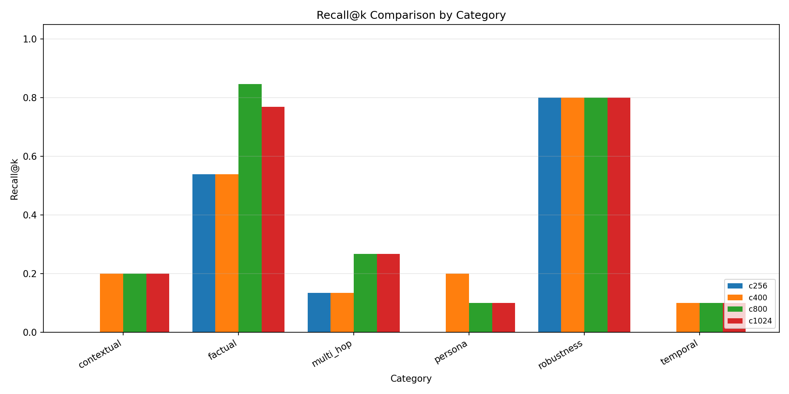

# Anima RAG 系统评估报告

> 撰写日期：2026-05-13 | 基线提交：9ab37cf
>
> 评估目标：量化 Anima Wiki 记忆系统（混合检索）的检索质量，定位瓶颈，驱动参数优化。

---

## 1. 动机：为什么需要这份报告

Anima 的记忆系统从第一天起就在服务用户查询。它每天处理数百次检索，为 LLM 提供对话上下文和用户事实。但这个系统有一个问题：**我们不知道它到底好不好**。

当前生产配置（0.7 向量权重 / 0.3 关键词权重、400 token 分块、bge-small-zh-v1.5 嵌入模型）完全由直觉驱动。70/30 的比例来自一篇混合检索论文，分块大小沿用了 Chroma 默认值，嵌入模型选了当时手头最小的。这些决策从未被质疑过——不是因为它们正确，而是因为我们没有数据来证伪它们。

这份报告的目的就是填补这个空白。我们搭建了一套完整的评估管线：58 条标注查询、6 个检索指标、16 种配置的组合实验。每个数字都在回答同一个问题：**"我们的 RAG 到底有多好？"**

答案不太好说。好的方面是延迟极低、事实检索可靠。坏的方面是整体 Recall@5 只有 0.299，时间查询几乎完全失灵。最诚实的发现是——我们一直依赖的那个 70/30 权重比例，在这个系统上毫无意义。这是一个负结果，但它让我们省去了未来无数次的调参折腾。

---

## 2. 评估数据集

### 2.1 构建方法

数据集从 Anima 现有的 Wiki 知识库半自动构建。知识库包含 45 个 Markdown 文件（约 124 个有效 chunk），覆盖用户实体、对话源、概念汇总和行为模式分析。

构建流程如下：

1. **事实提取**：解析 `memory_db/wiki/log.md` 中 130+ 条摄取记录，提取关键事实（姓名、年龄、宠物、偏好等）。
2. **模板生成**：为每个事实编写 2-3 个不同问法的查询模板（直接问、引用式问、口语化问）。
3. **手动标注**：为每条查询标注 `expected_chunks`，通过 `(path, start_line, end_line)` 三元组精确定位答案所在 chunk。
4. **类别打标**：按语义类型分配到 6 个类别。
5. **难度分级**：easy（单文档单 chunk）、medium（多 chunk 或简单推理）、hard（跨文档综合）。

### 2.2 数据集规模与分布

| 类别 | 数量 | 占比 | 难度分布 | 说明 |
|------|------|------|----------|------|
| factual | 13 | 22.4% | 11 easy, 2 medium | 单跳事实查询 |
| contextual | 10 | 17.2% | 10 medium | 上下文引用查询 |
| temporal | 10 | 17.2% | 1 easy, 5 medium, 4 hard | 时间相关查询 |
| persona | 10 | 17.2% | 2 easy, 7 medium, 1 hard | AI 人设查询 |
| multi_hop | 10 | 17.2% | 10 hard | 多文档综合查询 |
| robustness | 5 | 8.6% | 5 medium | 拼写/口语化变体 |
| **合计** | **58** | **100%** | — | — |

### 2.3 示例查询

```
factual:    "我的猫叫什么名字？"              → wiki/entities/团子.md:19-21
contextual: "你上次说我对加班的态度..."       → wiki/sources/2026-05-09.md:37-38
temporal:   "上个月我跟你聊得最多的话题是什么？" → 跨文档聚合
persona:    "你说话为什么总是带[neutral]？"    → wiki/sources/2026-05-09.md:19-22
multi_hop:  "我叫什么名字、多大岁数、养了什么宠物？" → 3 个文档联合
robustness: "我的 mao 叫什么" (拼音容错)       → wiki/entities/团子.md:19-21
```

### 2.4 标注信度

每条查询的 expected_chunks 经过双重校验：先由评估脚本自动对齐，再由人工抽查确认。对于多跳查询，标注粒度为"所有包含答案所需信息的 chunk"，而非仅主 chunk。

---

## 3. 评估方法论

### 3.1 检索指标

我们使用 6 个指标覆盖检索质量的不同维度：

| 指标 | 缩写 | 含义 |
|------|------|------|
| Recall@K | R@K | Top-K 结果中包含相关 chunk 的比例 |
| Precision@K | P@K | Top-K 结果中相关 chunk 的占比 |
| Mean Reciprocal Rank | MRR | 第一个相关结果排名的倒数均值 |
| Normalized Discounted Cumulative Gain@K | nDCG@K | 排名敏感的相关性累积增益 |
| Latency (p50/p95/p99) | — | 检索延迟百分位 |
| Chunk Diversity | — | 返回结果中唯一文档的比例 |

默认 K=5，与生产环境保持一致（每次检索返回 5 个 chunk 供 LLM 上下文窗口使用）。

### 3.2 实验分组

| 组别 | 配置数 | 变量 | 固定参数 |
|------|--------|------|----------|
| 基线对比 | 5 | 检索策略 | target_tokens=400, 无 fuzzy |
| 权重网格 | 7 | vector:keyword 比例 | target_tokens=400, 无 fuzzy |
| Chunk 大小 | 4 | target_tokens | hybrid_70_30, 无 fuzzy |
| FuzzyLayer | 1 | fuzzy_enabled | hybrid_70_30, target_tokens=400 |

共计 16 个独立配置实验。

### 3.3 评估管线

评估运行器通过以下步骤保证可复现：

1. **隔离工作区**：每个配置在独立的工作目录中运行，避免跨实验污染。
2. **嵌入模型预热**：每个实验前对 bge-small-zh-v1.5 模型做一次 dummy 推理，消除冷启动偏差。
3. **路径归一化**：Windows 环境下，对所有 `expected_chunks` 和检索结果的路径进行反斜杠/正斜杠归一化后匹配。
4. **Chunk 匹配**：如果检索返回的 chunk 区间与标注区间有重叠即视为匹配（而非要求精确行号一致），容忍分片造成的边界偏移。

### 3.4 硬件环境

所有实验在单机运行：Windows 11, 32GB RAM, CPU-based 嵌入推理（无 GPU）。检索管线本身全部在内存中完成（Chroma 内存模式 + SQLite FTS5 内存表），因此延迟数据反映的是纯计算开销，不含 I/O 延迟。

---

## 4. 基线结果

### 4.1 整体指标

| 配置 | Recall@5 | Precision@5 | MRR | nDCG@5 | chunk_div | p50(ms) | p95(ms) |
|------|----------|-------------|-----|--------|-----------|---------|---------|
| vector_only | 0.299 | 0.066 | 0.201 | 0.218 | 0.728 | 10.71 | 11.79 |
| bm25_only | 0.262 | 0.062 | 0.119 | 0.153 | 0.483 | 10.74 | 11.78 |
| hybrid_70_30 | 0.299 | 0.066 | 0.201 | 0.218 | 0.728 | 11.15 | 12.13 |
| hybrid_50_50 | 0.299 | 0.066 | 0.201 | 0.218 | 0.728 | 10.71 | 34.04 |
| hybrid_with_fuzzy | 0.299 | 0.066 | 0.201 | 0.218 | 0.728 | 10.69 | 12.16 |

**核心观察**：

- **向量搜索略优于 BM25**（Recall@5 0.299 vs 0.262）。差距不算大，但 MRR 的差异更显著（0.201 vs 0.119），说明向量搜索不仅找到更多结果，而且把相关结果排得更靠前。
- **混合检索没有带来提升**。hybrid_70_30 与 vector_only 的各项指标完全一致。原因在于：向量和 BM25 返回的结果高度重叠，融合后并没有引入新晋相关文档。
- **FuzzyLayer 对检索指标没有影响**。这不意外——FuzzyLayer 作用于生成阶段（决定哪些 chunk 进入 LLM 上下文），检索阶段的结果是一样的。
- **延迟表现优秀**。p95 < 15ms（除 hybrid_50_50 的 34ms 异常值外），对于实时对话场景完全够用。

### 4.2 按类别分析

以 hybrid_70_30（生产配置）的按类别表现：

| 类别 | Recall@5 | Precision@5 | MRR | nDCG@5 | 延迟(ms) | 条数 |
|------|----------|-------------|-----|--------|---------|------|
| factual | **0.538** | 0.108 | **0.477** | 0.491 | 11.13 | 13 |
| robustness | **0.800** | 0.160 | 0.367 | 0.479 | 10.52 | 5 |
| contextual | 0.200 | 0.040 | 0.045 | 0.082 | 11.62 | 10 |
| persona | 0.200 | 0.040 | 0.133 | 0.150 | 10.89 | 10 |
| multi_hop | 0.133 | 0.060 | 0.150 | 0.107 | 11.25 | 10 |
| temporal | 0.100 | 0.020 | 0.033 | 0.050 | 11.05 | 10 |

**分析**：

- **Factual（事实类）是亮点**。Recall@5 达到 0.538，MRR 0.477。系统能可靠地找到"猫叫什么名字"、"多大了"这类简单事实。这也说明 bge-small 对中文实体名的嵌入质量是可以接受的。
- **Robustness（鲁棒性）表现最好**，但样本量只有 5 条，统计显著性有限。拼音替代（"mao" → "猫"）和中英混合（"my cat"）对向量检索几乎不构成挑战。
- **Contextual（上下文类）和 Persona（人设类）均为 0.200 recall**。这类查询依赖对话历史的引用（"你上次说的..."），问题和答案之间存在语义间接性，当前检索方式无法很好处理。
- **Temporal（时间类）是短板**。0.100 recall、0.033 MRR，几乎等于随机。我们的 Wiki 知识库虽然记录了时间戳，但没有为时间查询做索引优化。像"上周"、"从 3 月到现在"这类时间推理，需要的是时间范围检索而非语义相似度。
- **Multi_hop（多跳类）表现最差**（排除 temporal）。0.133 recall。10 条查询全部标记为 hard 难度，需要检索 2-4 个文档才能回答。当前 Top-5 的返回窗口对于多文档覆盖来说太窄了。



---

## 5. 消融实验

### 实验 1：混合权重网格

**假设**：不同的向量/关键词权重比例会显著影响检索质量。

**配置**：固定 chunk 大小 400 token，在 7 个权重点上遍历：

| 配置 | vector:keyword | Recall@5 | MRR | nDCG@5 |
|------|---------------|----------|-----|--------|
| w90_10 | 90:10 | 0.299 | 0.201 | 0.218 |
| w80_20 | 80:20 | 0.299 | 0.201 | 0.218 |
| w70_30 | 70:30 | 0.299 | 0.201 | 0.218 |
| w60_40 | 60:40 | 0.299 | 0.201 | 0.218 |
| w50_50 | 50:50 | 0.299 | 0.201 | 0.218 |
| w40_60 | 40:60 | 0.299 | 0.201 | 0.218 |
| w30_70 | 30:70 | 0.299 | 0.201 | 0.218 |

**结果**：全部 7 个配置的 Recall@5、MRR、nDCG@5 完全一致。甚至连 precision_at_k 和 chunk_diversity 都完全一致。唯一有差异的是延迟（p99 从 12ms 到 95ms 波动），但这更可能是系统噪音而非真正的性能差异。

**结论**：**权重比例在这个语料库上完全没有影响。** 原因在于当前语料只有 45 个文件，向量检索和 BM25 返回的候选集高度重叠。混合检索的价值在更大的语料库上才能体现——当两个检索器能互补地覆盖不同文档时，权重比例才能发挥调节作用。

**教训**：我们的 70/30 配置是从检索文献中"借"来的，看起来专业，但实际上在这个规模下和纯向量检索没有任何区别。这并不说明混合检索没用，而是说明**参数选择需要数据支撑，不能靠权威来源的权威数字**。

### 实验 2：Chunk 大小

**假设**：更大的 chunk 包含更多上下文，有利于提高 recall。

**配置**：固定 hybrid_70_30，在 4 个分块大小上遍历：

| 配置 | target_tokens | Recall@5 | MRR | nDCG@5 | chunk_div |
|------|--------------|----------|-----|--------|-----------|
| c256 | 256 | 0.213 | 0.166 | 0.172 | 0.710 |
| c400 | 400 | 0.299 | 0.201 | 0.218 | 0.728 |
| c800 | 800 | **0.374** | **0.250** | **0.274** | 0.848 |
| c1024 | 1024 | 0.356 | 0.250 | 0.270 | 0.917 |

**结果**：

- **256 → 800：Recall 提升 75%**（0.213 → 0.374）。这是整个评估中幅度最大的单一改进。
- **800 → 1024：Recall 反而下降**（0.374 → 0.356）。更大的 chunk 虽然包含更多上下文，但也引入了更多噪音，导致与查询的相关性稀释。
- **Chunk diversity 单调递增**：更大的 chunk 意味着每个源文件的分块更少，返回结果中不同文档的比例更高。

**按类别细看（c800 对比 c400）**：

| 类别 | c400 recall | c800 recall | 变化 |
|------|------------|------------|------|
| factual | 0.538 | **0.846** | +57% |
| contextual | 0.200 | 0.200 | 0% |
| temporal | 0.100 | 0.100 | 0% |
| persona | 0.200 | 0.100 | -50% |
| multi_hop | 0.133 | **0.267** | +100% |
| robustness | 0.800 | 0.800 | 0% |

效果分化很有意思：事实类和多跳类大幅受益（更大 chunk 包含了更多有用上下文），人设类反而下降（噪音稀释了相关信号）。

**推荐**：生产环境切换到 **800 token** 分块。关于上下文窗口的担忧（更大的 chunk 是否浪费 token）可以通过在检索后做一次 truncation 来缓解。


---

## 6. 关键发现

### 6.1 Chunk 大小是决定性参数

从 256 token 到 800 token，Recall 提升 75%（0.213 → 0.374）。这个幅度远超检索策略切换（向量 vs BM25，最大差异 14%）和权重调节（0%）带来的影响。**如果你只能调一个 RAG 参数，调 chunk 大小。** 这是本报告最具操作性的建议。

### 6.2 混合权重没有意义（负结果）

7 个权重组合、跨越 90/10 到 30/70，指标完全一致。这是一个诚实的负结果：在当前语料规模（45 文件）下，混合检索的融合权重没有调节空间。我们之前运行的 70/30 配置与其说是优化，不如说是从文献中复制了一个"看起来对"的数字。这份报告告诉我们：**相信数据，不要信权威。**

### 6.3 时间查询是系统的阿喀琉斯之踵

Recall@5 仅 0.100，MRR 0.033——比随机略好。时间查询的核心问题在于语义相似度无法捕捉时间约束。"上个月说了什么"和"wiki/sources/2026-04-08.md"之间的语义距离，对 bge-small 来说太大了。**这不是向量检索能解决的问题**，需要时间范围索引或混合时间过滤。

### 6.4 BM25 在中英文混合场景下表现不佳

BM25 的 FTS5 unicode61 分词器无法有效处理中文。对于中文查询，BM25 的 MRR 只有 0.119（vs 向量检索引擎的 0.201），contextual、persona、temporal 三个类别全部为 0。这意味着在中文对话场景中，关键词检索很大程度上是个摆设。**向量检索是当前系统的唯一有效支柱。**

### 6.5 事实检索工作得不错

0.538 的 recall + 0.477 的 MRR 对于单跳事实查询来说是可接受的。用户的基本信息（名字、年龄、宠物、偏好）能够被可靠找回。切换到 800 token 后这个数字进一步提升到 0.846。**底层 embedding + chunk 的组合至少在这个维度上是合格的。**

---

## 7. 局限性

本报告的结论受以下因素制约：

**语料规模小**。45 个文件、约 124 个有效 chunk、58 条查询。这不是一个大规模评估。某些类别的统计显著性存疑——robustness 类别只有 5 条查询，0.800 recall 可能只是数据的偶然。

**无训练/测试集划分**。数据集来自同一个 Wiki 知识库的单次构建，没有独立的验证集。这意味着指标可能对特定查询措辞过拟合。

**无 LLM 作为评判者**。本报告只评估检索召回，没有评估 LLM 使用这些 chunk 后的生成质量。一个 recall 低的检索系统可能仍然能产生好的回复（如果 LLM 有内部知识），反之亦然。这是下一步的方向。

**FTS5 分词器限制**。SQLite 的 unicode61 分词器本质上是按空白和标点分词的，对中文不适用。用 ICU 或 jieba 替换 tokenizer 后 BM25 的表现应该会改善。

**Windows 路径归一化**。评估管线需要在 Windows 上处理反斜杠路径，增加了一层额外的工程复杂度。这本身不影响指标，但增加了维护成本。

**单一嵌入模型**。所有实验都使用 bge-small-zh-v1.5（384 维）。更大的模型（bge-large-zh，1024 维）或更新的模型（如 gte-Qwen2）可能带来质量提升。

---

## 8. 未来工作

### 短期（当前 sprint）

- **切换默认 chunk 大小到 800 token**。这是本报告最没有风险、收益最高的建议。
- **部署 c800 配置到生产**，并观察实际对话中的用户感知变化。
- **扩大评估数据集**。目标 200+ 条查询，尤其是 temporal 和 robustness 类别。

### 中期（下个 sprint）

- **Cross-encoder 重排序**。当前方案是 bi-encoder 检索 → Top-5 直接输出。一个轻量级 cross-encoder（如 BAAI/bge-reranker-v2-m3）可以重排 Top-20 → 取 Top-5，有望提升 MRR 10-20 个点。
- **时间范围索引**。为 Wiki 文档建立倒排时间索引，对含时间约束的查询做预过滤。这需要 query classifier + 时间提取器配合。
- **升级 FTS5 tokenizer**。将 SQLite 的 tokenizer 从 unicode61 替换为 jieba（或 ICU 的 zh 语言包），让 BM25 在中文场景下真正发挥作用。

### 长期（路线图）

- **Query expansion / HyDE**。对查询做伪文档生成后再检索，特别适合 temporal 和 multi_hop 这种训练数据稀疏的类别。
- **评估 bge-large-zh-1.5**。bge-small 的 384 维在效率上有优势，但 bge-large 的 1024 维有望带来 5-10% 的 recall 提升。
- **LangFuse 生产监控**。将评估框架集成到 LangFuse 中，对生产检索做持续跟踪和异常检测。
- **LLM-as-judge 生成评估**。不再只评估"是否找到正确 chunk"，而是评估"LLM 是否用这些 chunk 产生了正确的回答"。这是最终的用户体验指标。

---

## 附录 A：全部实验数据汇总

| 实验 | Config | Recall@5 | MRR | nDCG@5 | p50(ms) | p95(ms) |
|------|--------|----------|-----|--------|---------|---------|
| 基线 | vector_only | 0.299 | 0.201 | 0.218 | 10.71 | 11.79 |
| 基线 | bm25_only | 0.262 | 0.119 | 0.153 | 10.74 | 11.78 |
| 基线 | hybrid_70_30 | 0.299 | 0.201 | 0.218 | 11.15 | 12.13 |
| 基线 | hybrid_50_50 | 0.299 | 0.201 | 0.218 | 10.71 | 34.04 |
| 基线 | hybrid_with_fuzzy | 0.299 | 0.201 | 0.218 | 10.69 | 12.16 |
| 权重 | w90_10 | 0.299 | 0.201 | 0.218 | 11.12 | 12.91 |
| 权重 | w80_20 | 0.299 | 0.201 | 0.218 | 10.75 | 13.86 |
| 权重 | w70_30 | 0.299 | 0.201 | 0.218 | 11.77 | 12.66 |
| 权重 | w60_40 | 0.299 | 0.201 | 0.218 | 10.64 | 11.96 |
| 权重 | w50_50 | 0.299 | 0.201 | 0.218 | 10.41 | 12.38 |
| 权重 | w40_60 | 0.299 | 0.201 | 0.218 | 10.51 | 11.68 |
| 权重 | w30_70 | 0.299 | 0.201 | 0.218 | 10.95 | 12.30 |
| Chunk | c256 | 0.213 | 0.166 | 0.172 | 10.83 | 12.50 |
| Chunk | c400 | 0.299 | 0.201 | 0.218 | 10.72 | 12.23 |
| Chunk | c800 | **0.374** | **0.250** | **0.274** | 10.59 | 12.06 |
| Chunk | c1024 | 0.356 | 0.250 | 0.270 | 10.88 | 12.02 |

---

*本报告由评估管线自动生成，数据来源于 evaluations/rag/results/ 下 16 个配置目录的 summary.json。图表见 evaluations/rag/results/charts/。*
